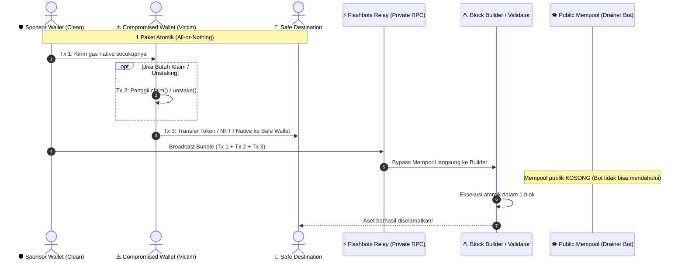
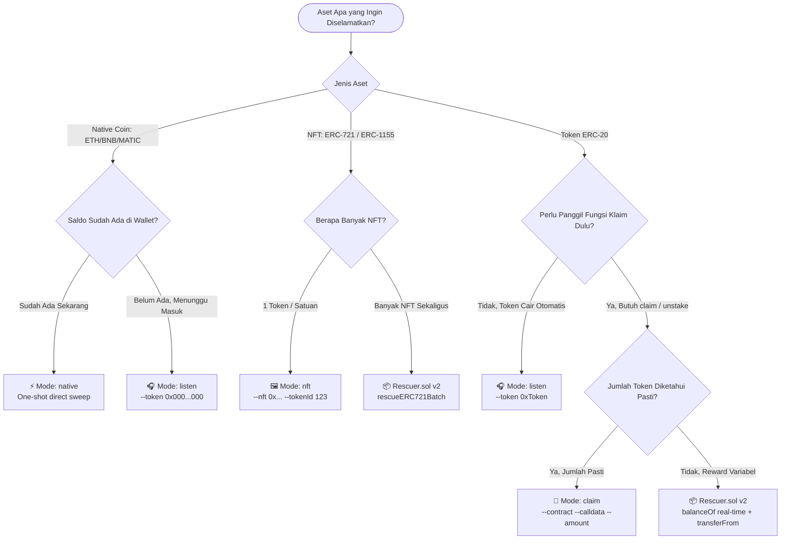
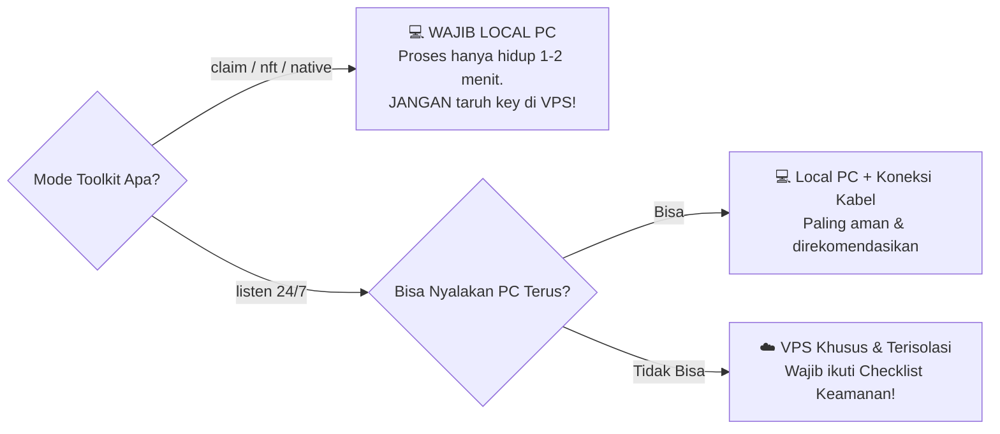

# 🛡️ EVM Rescue Toolkit

<div align="center">

[](https://x.com/Prasetyo_HK)
[](https://github.com/gamecore08/EVM_Rescue_Toolkit)
[](https://www.typescriptlang.org/)
[](https://docs.ethers.org/v6/)
[](https://docs.flashbots.net/)
[](LICENSE)

**Toolkit whitehat headless CLI untuk menyelamatkan aset (ERC-20, NFT, Native Coin) dari wallet EVM yang bocor/dipantau bot drainer menggunakan bundle privat Flashbots.**

*Headless whitehat CLI toolkit to recover assets from compromised EVM wallets via atomic Flashbots private bundles.*

[📘 Panduan Lengkap (Bahasa Indonesia)](docs/PANDUAN_ID.md) • [📘 Full Technical Guide (English)](docs/GUIDE_EN.md) • [☕ Support & Donations](#-support--donations)

</div>

---

## 🖥️ Terminal Preview (Headless CLI in Action)

Toolkit ini berjalan 100% headless di Terminal CLI tanpa GUI browser untuk menjamin kecepatan eksekusi dan keamanan private key tanpa risiko sniffing dari browser extensions:

```text
┌────────────────────────────────────────────────────────────────────────────────┐
│  🛡️  EVM RESCUE TOOLKIT v0.2.0 - Headless Whitehat Recovery Terminal          │
├────────────────────────────────────────────────────────────────────────────────┤
│  [init] Network          : Ethereum Mainnet (Chain ID: 1)                      │
│  [init] Sponsor Wallet   : 0x8920...3F41 (Clean Funding EOA)                   │
│  [init] Compromised EOA  : 0x3A21...B89C (Compromised Wallet holding Assets)   │
│  [init] Safe Destination : 0x90A1...771B (Fresh Secure Cold Storage)           │
│                                                                                │
│  [plan] Gas Strategy     : EIP-1559 BaseFee: 24 Gwei | PriorityTip: 3 Gwei     │
│  [plan] Packaging 3-Tx Atomic Bundle (Direct to Block Builders)...             │
│         Tx 1: Sponsor funds exact native gas -> Compromised EOA               │
│         Tx 2: Compromised EOA calls claim() / unstake()                       │
│         Tx 3: Compromised EOA transfers 10,000.00 TOKEN -> Safe Destination   │
│                                                                                │
│  [sim]  Running Flashbots simulate against block #20761284...                  │
│  [sim]  Simulation Result : SUCCESS (Revert: False, Gas Used: 142,500)         │
│  [send] Submitting Raw Bundle to Flashbots Relay (Bypassing Public Mempool)... │
│  [conf] ✅ BUNDLE INCLUDED IN BLOCK #20761284!                                 │
│  [done] 🎉 All assets successfully secured into safe destination!              │
└────────────────────────────────────────────────────────────────────────────────┘
```

---

## 🔄 1. Bagan Alur Bundle Flashbots (Sequence Diagram)

Transaksi pengiriman gas dan pemindahan aset dikemas menjadi **satu paket atomik (*all-or-nothing*)** yang dikirim langsung ke builder tanpa melalui mempool publik, sehingga bot drainer tidak memiliki kesempatan untuk mendahului (*front-run*):



---

## 🌳 2. Pohon Keputusan (Decision Tree) Pemilihan Mode

Gunakan alur diagram ini untuk menentukan mode yang paling tepat untuk situasi Anda:



---

## 💻 3. Rekomendasi Deployment: Local PC vs Cloud VPS

Kapan harus menjalankan toolkit di PC lokal dan kapan menggunakan server VPS?



| Mode | Rekomendasi | Alasan Keamanan |
|---|---|---|
| `claim`, `nft`, `native` | **100% Local PC** | Eksekusi instan (1–2 menit). Menaruh private key di VPS untuk proses singkat adalah risiko yang tidak perlu. |
| `listen` (Auto-sweep) | **Local PC** (Diutamakan) / **Hardened VPS** | Mode memantau 24/7. Jika memakai VPS, gunakan server baru dan terisolasi serta destroy segera setelah selesai. |

*Analisis lengkap risiko keamanan VPS tersedia di [docs/PANDUAN_ID.md](docs/PANDUAN_ID.md#3-local-pc-sendiri-vs-vps-analisis-keamanan--sisi-ga-enak-nya).*

---

## ⚡ Quick Start (Cara Cepat Menjalankan)

```bash
# 1. Clone repository
git clone https://github.com/gamecore08/EVM_Rescue_Toolkit.git
cd EVM_Rescue_Toolkit

# 2. Instal dependensi
npm install

# 3. Salin dan edit konfigurasi .env
cp .env.example .env
```

---

## 🔌 Panduan Lengkap `.env`, RPC HTTP, WSS, & Private Relay

Bagi pemula yang baru pertama kali menyetel konfigurasi bot/script Web3, berikut panduan lengkap mengenai apa saja yang harus diisi di `.env`, di mana mengambilnya, dan untuk apa fungsinya:

### 1. Perbedaan 3 Jenis Endpoint di Toolkit

| Nama di `.env` | Jenis Endpoint | Fungsi Utama | Kapan Dipakai? |
|---|---|---|---|
| `RPC_HTTP_URL` | **Regular RPC (HTTP/S)** | **MEMBACA data**: Membaca saldo token korban, nonce transaksi, dan estimasi base gas. | Dipakai di **semua mode**. |
| `RPC_WSS_URL` | **WebSocket RPC (`wss://`)** | **MENDENGARKAN event**: Saluran pipa real-time 2 arah agar node langsung memberi tahu laptop Anda begitu ada blok baru (<50ms). | **WAJIB untuk mode `listen`** (auto-sweeper pasif). |
| `FLASHBOTS_RELAY_URL` | **Private Relay Endpoint** | **MENGIRIM transaksi privat**: Menyerahkan bundle atomik langsung ke Block Builder **tanpa lewat mempool publik**. | Dipakai saat **mengeksekusi penyelamatan** agar bot drainer buta. |

### 2. Di Mana Mengambil RPC (HTTP & WSS) dan Berapa Biayanya?

> 💰 **BIAYANYA 100% GRATIS (FREE TIER)!**  
> Anda **tidak perlu membayar sepeser pun**. Provider Web3 RPC terkemuka menyediakan paket gratis yang kuotanya sangat berlimpah (ratusan juta request per bulan):

1. **[Alchemy](https://www.alchemy.com/) (Paling Direkomendasikan):**
   - Daftar akun gratis di Alchemy.
   - Klik **"Create App"** $\to$ Pilih Network (misal: *Ethereum*, *Sepolia*, *Base*, atau *Arbitrum*).
   - Klik tombol **"API Key"**:
     - Salin bagian **HTTPS** $\to$ Tempel ke `RPC_HTTP_URL` di `.env`.
     - Klik tab **WebSockets** dan salin bagian **WSS** $\to$ Tempel ke `RPC_WSS_URL` di `.env`.
2. **[Infura](https://www.infura.io/):**
   - Daftar akun gratis $\to$ Buat API Key $\to$ Dapatkan URL HTTPS dan WSS di tab Endpoints.
3. **Public RPC Gratis (Khusus Sepolia Testnet):**
   - `RPC_HTTP_URL=https://rpc.sepolia.org`

### 3. Untuk Apa Private Relay (`FLASHBOTS_RELAY_URL`) Dipakai?

Jika Anda mengirim transaksi lewat RPC biasa (seperti MetaMask pada umumnya), transaksi Anda akan mengapung di **mempool publik**. Bot drainer yang memantau wallet bocor Anda akan langsung melihatnya dan menyerobot (*front-run*) uang Anda.

**Private Relay** adalah jalur khusus "bawah tanah":
- Bundle transaksi dikirim langsung ke meja validator/block builder.
- Tidak ada yang bisa melihat transaksi tersebut sampai blok tersebut selesai ditambang di blockchain.
- **Relay Resmi Flashbots:**
  - Mainnet: `https://relay.flashbots.net`
  - Sepolia Testnet: `https://relay-sepolia.flashbots.net`

### 4. Penjelasan 4 Kunci Utama di `.env`

- `COMPROMISED_PRIVATE_KEY`: Private key wallet Anda yang sudah bocor / dipantau bot drainer.
- `SPONSOR_PRIVATE_KEY`: Private key wallet baru yang bersih dan memiliki saldo ETH/BNB untuk membayar gas penyelamatan.
- `SAFE_DESTINATION_ADDRESS`: Alamat publik (`0x...`) wallet dingin penampung aset yang aman.
- `FLASHBOTS_AUTH_SIGNER_KEY`: Private key wallet sembarang baru (boleh kosong melompong tanpa saldo). Kunci ini hanya digunakan relay Flashbots sebagai "tanda tangan identitas" untuk mengukur reputasi bundle dan mencegah serangan DoS.

---

## 🕹️ Daftar Perintah Utama

```bash
# 1. Calldata Generator Interaktif (Klaim Airdrop / Staking)
npm run encode

# 2. Mode Claim (Dengan Simulasi Dry-Run terlebih dahulu)
npm run rescue -- --mode claim --contract 0x... --calldata 0x... --token 0x... --amount 1000 --dry-run

# 3. Mode Claim (Eksekusi Nyata)
npm run rescue -- --mode claim --contract 0x... --calldata 0x... --token 0x... --amount 1000

# 4. Mode Listen (Memantau blok secara pasif hingga saldo token muncul)
npm run rescue -- --mode listen --token 0xTokenAddress

# 5. Mode NFT (ERC-721 / ERC-1155)
npm run rescue -- --mode nft --nft 0xContract --tokenId 123 --standard erc721

# 6. Mode Native (Sapu bersih saldo ETH/BNB/MATIC yang ada saat ini)
npm run rescue -- --mode native

# 7. Compile & Jalankan Unit Test Hardhat
npm run compile
npm test
```

---

## 🧪 Panduan Latihan & Simulasi Aman di Sepolia Testnet

Sebelum menyentuh dana nyata di mainnet, **sangat disarankan berlatih terlebih dahulu di Sepolia Testnet**. Flashbots menyediakan relay publik khusus Sepolia sehingga Anda bisa menguji alur bundle tanpa mengeluarkan uang sepeser pun.

### Langkah 1: Dapatkan Sepolia ETH Gratis
Kirim sedikit Sepolia ETH (cukup 0.05 ETH) ke **Sponsor Wallet**:
- [Google Cloud Sepolia Faucet](https://cloud.google.com/application/web3/faucet/ethereum/sepolia)
- [Alchemy Sepolia Faucet](https://sepoliafaucet.com/)
- [PoW Faucet Sepolia](https://sepolia-faucet.pk910.de/)

### Langkah 2: Konfigurasi `.env` untuk Sepolia
```env
CHAIN_ID=11155111
RPC_HTTP_URL=https://rpc.sepolia.org
SEPOLIA_RPC_URL=https://rpc.sepolia.org
FLASHBOTS_RELAY_URL=https://relay-sepolia.flashbots.net

COMPROMISED_PRIVATE_KEY=0x... (Private key wallet latihan yang berpura-pura bocor)
SPONSOR_PRIVATE_KEY=0x...     (Private key wallet bersih yang berisi Sepolia ETH)
SAFE_DESTINATION_ADDRESS=0x... (Alamat wallet aman penampung aset)
FLASHBOTS_AUTH_SIGNER_KEY=0x... (Private key sembarang baru untuk reputasi relay)
```

### Langkah 3: Setup Kontrak Mock Otomatis di Sepolia
Jalankan perintah ini:
```bash
npm run testnet:setup
```
Script ini akan:
1. Men-deploy `MockToken` ($MRT) ke Sepolia.
2. Men-deploy kontrak klaim `MockStaking` ke Sepolia.
3. Mendaftarkan wallet korban ke posisi stake (saldo awal = 0).
4. Menghasilkan perintah CLI lengkap yang siap Anda jalankan!

### Langkah 4: Eksekusi Penyelamatan Latihan
```bash
# 1. Uji simulasi (dry-run) tanpa broadcast:
npm run rescue -- --mode claim --contract <ALAMAT_STAKING> --calldata 0x4e71d92d --token <ALAMAT_TOKEN> --amount 1000 --dry-run

# 2. Eksekusi nyata di Sepolia:
npm run rescue -- --mode claim --contract <ALAMAT_STAKING> --calldata 0x4e71d92d --token <ALAMAT_TOKEN> --amount 1000
```
Setelah berhasil masuk ke dalam blok Sepolia, Anda dapat mengecek explorer Sepolia Etherscan bahwa 1000 MRT telah berhasil diselamatkan ke `SAFE_DESTINATION_ADDRESS`!

---

## 🤖 Panduan Pemula: Cara Minta Panduan Agent AI (Gemini / Claude / ChatGPT)

Jika Anda pemula dan bingung mengonfigurasi parameter atau membaca fungsi smart contract, Anda dapat meminta bantuan Agent AI (**ChatGPT, Claude, atau Google Gemini**).

> ⚠️ **PERINGATAN KEAMANAN TERBESAR:**  
> **JANGAN PERNAH memasukkan Private Key asli Anda ke dalam chat AI mana pun!** Gantilah private key Anda dengan teks contoh seperti `0x1111...1111`.

### 📋 Contoh Template Prompt untuk AI:

Salin dan tempel prompt di bawah ini ke AI Anda:

```text
Halo, saya sedang menggunakan toolkit "EVM Rescue Toolkit" untuk menyelamatkan aset dari wallet saya yang private key-nya bocor.
Saya ingin meminta panduan teknis langkah demi langkah untuk kasus saya:

1. Jenis Aset: [Contoh: Token ERC-20 / NFT ERC-721 / Saldo Native ETH]
2. Nama Jaringan: [Contoh: Ethereum Mainnet / Base / Arbitrum / BSC / Sepolia]
3. Skenario: [Contoh: Saya ingin klaim airdrop dari kontrak 0xAbc... lalu langsung dipindahkan ke wallet aman saya]
4. Nama Fungsi Klaim: [Contoh: claim() / unstake(amount)]

Tolong bantu saya:
a. Berikan calldata yang harus saya gunakan atau cara menjalankannya di toolkit.
b. Tuliskan perintah CLI yang tepat untuk saya jalankan di terminal.
Catatan: Saya TIDAK akan membagikan private key saya kepada Anda.
```

---

## 📁 Struktur Repositori

```text
EVM_Rescue_Toolkit/
├── contracts/
│   ├── Rescuer.sol            # Kontrak v2 on-chain real-time balance rescue
│   └── test/MockContracts.sol # Mock kontrak untuk pengujian unit test
├── docs/
│   ├── PANDUAN_ID.md          # Panduan lengkap Bahasa Indonesia
│   └── GUIDE_EN.md            # Full Technical Guide English
├── scripts/
│   └── deploy.ts              # Script deploy Rescuer.sol via Hardhat
├── src/
│   ├── config/chains.ts       # Konfigurasi RPC & Flashbots relay
│   ├── modules/
│   │   ├── flashbotsClaim.ts  # Mode claim
│   │   ├── passiveSweeper.ts  # Mode listen
│   │   ├── nftRescue.ts       # Mode nft
│   │   └── nativeSweeper.ts   # Mode native
│   ├── utils/
│   │   ├── rawSigner.ts       # Perhitungan gas EIP-1559 & builder tx
│   │   └── encoder.ts         # CLI calldata generator interaktif
│   └── index.ts               # CLI Entrypoint utama
├── test/
│   └── rescuer.test.ts        # Unit test Hardhat
├── hardhat.config.ts          # Konfigurasi compiler Hardhat
├── package.json               # Dependensi proyek (Ethers v6)
└── tsconfig.json              # Konfigurasi TypeScript
```

---

## ☕ Support & Donations

If this project helped you rescue your funds, contributions are greatly appreciated:

- **EVM (Ethereum, Base, Arbitrum, BSC, Polygon):**  
  `0xFCDD187D32cFaecD8B07638BD6004fA2bF6838C6`
- **Solana (SOL & SPL Tokens):**  
  `2zyBHgVYNp5WnKUK25WsdsQbsMzkj8Kzw2wDePWAnGZYS`
- **Sui:**  
  `0xfac84087048bf82f4f99c7704ee0cf9b1386c064b8ea845ab6baf65d1153eb09`
- **Bitcoin (BTC):**  
  `bc1qulgaaddxhl9qz5jcs4wu5tx5j3g9ng3lfd4cl0`

---

## 📄 License

Distributed under the [MIT License](LICENSE).
