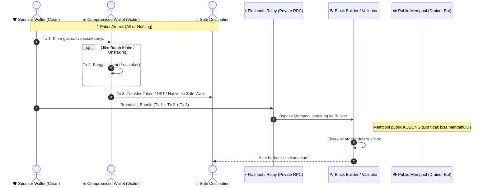

# 🛡️ evm-rescue-toolkit

`Author:` [@Prasetyo_HK](https://x.com/Prasetyo_HK) • `Status:` Active Development

Toolkit whitehat untuk menyelamatkan aset dari **wallet EVM sendiri yang bocor** (private key ter-expose / dipantau drainer bot), menggunakan **Flashbots bundle**: gas disponsori dan transaksi klaim/transfer dikirim sebagai satu paket atomik lewat jalur privat — tidak lewat mempool publik — sehingga drainer bot yang memantau alamatmu **tidak sempat mendahului**.

Referensi resmi yang dipakai sebagai dasar: [flashbots/searcher-sponsored-tx](https://github.com/flashbots/searcher-sponsored-tx) & [Flashbots Quick Start](https://docs.flashbots.net/flashbots-auction/quick-start).

📘 **Panduan lengkap**: [docs/PANDUAN_ID.md](docs/PANDUAN_ID.md) (Bahasa Indonesia) · [docs/GUIDE_EN.md](docs/GUIDE_EN.md) (English)

> ⚠️ **Hanya untuk wallet milik sendiri.** Toolkit ini dirancang untuk skenario "kunci saya bocor, saya balapan dengan bot untuk selamatkan sisa aset saya sendiri". Jangan dipakai terhadap wallet orang lain.

---

## 🔄 Alur Penyelamatan Flashbots Bundle



---

## Pilih skenario kamu

| Masalahmu | Mode | Contoh |
|---|---|---|
| Staking/unstaking, takut hasilnya disweep saat unlock | `listen` | `npm run rescue -- --mode listen --token 0xToken...` |
| Airdrop cair otomatis, takut keburu diambil bot | `listen` | `npm run rescue -- --mode listen --token 0xToken...` |
| Airdrop/klaim manual (perlu panggil `claim()` dulu) | `claim` | `npm run rescue -- --mode claim --contract 0x... --calldata 0x... --token 0x... --amount 1000` |
| Gas native coin (ETH/BNB/dst) yang mau diamankan sekarang | `native` | `npm run rescue -- --mode native` |
| Gas native yang belum muncul, ditunggu | `listen` (token = address 0) | `npm run rescue -- --mode listen --token 0x000...000` |
| NFT (ERC-721/1155) di wallet bocor | `nft` | `npm run rescue -- --mode nft --nft 0x... --tokenId 1234` |

> 💡 **Jalankan di Local atau VPS?** Baca panduan keamanan dan analisis risiko di [docs/PANDUAN_ID.md#3-local-pc-sendiri-vs-vps-analisis-keamanan--sisi-ga-enak-nya](docs/PANDUAN_ID.md). Mode `claim`/`nft`/`native` wajib dijalankan di Local PC!


---

## Quick Start

```bash
git clone <repo-ini>
cd evm-rescue-toolkit
npm install
cp .env.example .env
# isi semua field di .env sesuai kebutuhan (lihat komentar di dalamnya)
```

**4 hal wajib di `.env`:**
- `COMPROMISED_PRIVATE_KEY` — wallet yang bocor (yang mau diselamatkan)
- `SPONSOR_PRIVATE_KEY` — wallet bersih untuk bayar semua gas
- `SAFE_DESTINATION_ADDRESS` — wallet baru & aman, tujuan akhir dana
- `FLASHBOTS_AUTH_SIGNER_KEY` — wallet kosong baru, khusus identitas ke relay

**Selalu coba dulu di Sepolia testnet** (`CHAIN_ID=11155111`) sebelum ke mainnet — lihat panduan lengkap.

**Tidak yakin sebelum broadcast beneran?** Tambahkan `--dry-run` di mode `claim` untuk simulasi tanpa mengirim apa pun.

---

## Struktur Repo

```
evm-rescue-toolkit/
├── contracts/
│   ├── Rescuer.sol            # kontrak bantu v2: baca saldo real-time + batch rescue
│   └── test/MockContracts.sol # mock token & staking untuk unit test
├── scripts/
│   └── deploy.ts              # deploy Rescuer.sol via Hardhat
├── src/
│   ├── modules/
│   │   ├── flashbotsClaim.ts  # mode claim
│   │   ├── passiveSweeper.ts  # mode listen
│   │   ├── nftRescue.ts       # mode nft
│   │   └── nativeSweeper.ts   # mode native
│   ├── utils/
│   │   ├── rawSigner.ts       # gas planning, signing, token meta
│   │   └── encoder.ts         # CLI interaktif generate calldata klaim
│   ├── config/chains.ts       # daftar chain, relay, testnet
│   └── index.ts               # CLI terpadu
├── docs/
│   ├── PANDUAN_ID.md
│   └── GUIDE_EN.md
├── test/rescuer.test.ts       # unit test (npm test)
├── hardhat.config.ts
├── .env.example
├── package.json
└── tsconfig.json
```

## Perintah Penting

```bash
npm run rescue -- --mode <claim|listen|nft|native> [flags...]  # jalankan rescue
npm run encode                                                  # generate calldata klaim interaktif
npm run compile                                                 # compile Rescuer.sol
npm run deploy -- --network sepolia                             # deploy Rescuer.sol
npm test                                                         # unit test (membuktikan bug v1 & fix v2)
```

## Batasan & Disclaimer

- Ini **balapan (race)**, bukan jaminan menang.
- Selalu **simulasikan dulu** (`--dry-run`, atau `fbProvider.simulate` otomatis di mode claim) sebelum broadcast nyata.
- **Jangan pernah** taruh private key di kode/commit git — gunakan `.env` (sudah masuk `.gitignore`).
- Audit `Rescuer.sol` sebelum dipakai untuk dana besar. Uji dulu di Sepolia.

---

## ☕ Support & Donations

Kalau toolkit ini membantu, kontribusi sangat dihargai:

- **EVM** *(ETH, Base, Arbitrum, BSC, Polygon)*: `0xFCDD187D32cFaecD8B07638BD6004fA2bF6838C6`
- **Solana** *(SOL/SPL)*: `2zyBHgVYNp5WnKUK25WsdsQbsMzkj8Kzw2wDePWAnGZYS`
- **Sui**: `0xfac84087048bf82f4f99c7704ee0cf9b1386c064b8ea845ab6baf65d1153eb09`
- **Bitcoin**: `bc1qulgaaddxhl9qz5jcs4wu5tx5j3g9ng3lfd4cl0`

---

## License

MIT
