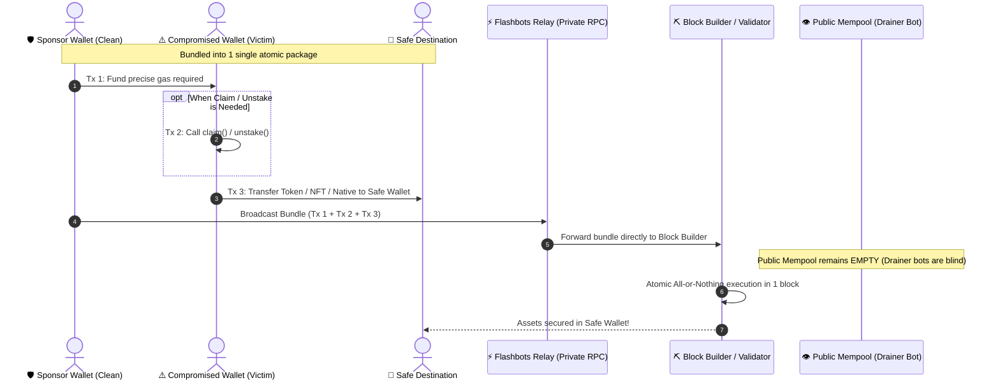
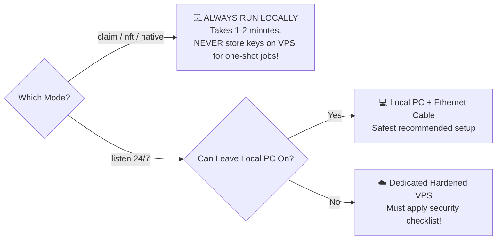

# 📘 Full Technical Guide (English)

`Author:` [@Prasetyo_HK](https://x.com/Prasetyo_HK) • `Status:` Active Development

## 1. Core Concept: Private Bundle vs Public Mempool

Normally, every transaction broadcast to an EVM network lands in the **public mempool** first — an open waiting pool monitored 24/7 by drainer bots. If you transfer native gas (ETH/BNB/MATIC) to a compromised wallet through standard transactions, the bot immediately spots the pending incoming tx and front-runs it, siphoning off the funds before your rescue operation can take place.

**Flashbots Bundles** eliminate this risk by:
1. Packaging the gas sponsorship transaction and the asset rescue/claim transactions into a **single atomic bundle**.
2. Sending the package **directly to block builders** through private RPC relays, completely bypassing the public mempool.
3. Guaranteeing an **all-or-nothing** execution: if any single transaction fails, the entire bundle reverts cleanly without leaving stray gas behind.

### Atomic Bundle Sequence Diagram



---

## 2. Mode Selection Decision Tree

Use this decision tree to pick the correct execution mode:


---

## 3. Understanding `.env`, HTTP/WSS RPCs, & Private Relays

Understanding each parameter in your `.env` configuration avoids costly mistakes and clarifies where to obtain endpoints:

### A. The 3 Types of Network Endpoints
1. **`RPC_HTTP_URL` (Standard HTTP/HTTPS RPC):**
   - **Purpose:** Used for **reading** on-chain state: querying token balances on the victim wallet, checking account nonces, fetching token decimals, and estimating current base fees.
   - **When is it used?** Active in all execution modes (`claim`, `listen`, `nft`, `native`).
2. **`RPC_WSS_URL` (WebSocket RPC - `wss://`):**
   - **Purpose:** A persistent 2-way real-time pipe. The blockchain node pushes block updates to your local terminal immediately upon confirmation (<50ms).
   - **When is it used?** **Mandatory for `listen` mode** (passive auto-sweeper).
3. **`FLASHBOTS_RELAY_URL` (Private Relay Endpoint):**
   - **Purpose:** A private tunnel directly to MEV block builders / validators.
   - **When is it used?** Used when **submitting rescue bundles**. Your transactions **NEVER land in the public mempool**, blinding drainer bots until your bundle is already confirmed.
   - *Mainnet:* `https://relay.flashbots.net` | *Sepolia:* `https://relay-sepolia.flashbots.net`

### B. Where to Get RPC Endpoints (HTTP & WSS) & Pricing
> 💰 **COST: 100% FREE!** You do not need any paid subscription.

- **[Alchemy.com](https://www.alchemy.com/):**
  1. Create a free account.
  2. Navigate to **Apps** $\to$ Click **Create App** (choose your target chain: Ethereum, Sepolia, Base, etc.).
  3. Click **API Key**:
     - Copy the **HTTPS** URL $\to$ paste to `RPC_HTTP_URL` in `.env`.
     - Click the **WebSockets** tab and copy the **WSS** URL $\to$ paste to `RPC_WSS_URL` in `.env`.
  *(Alchemy's free tier provides 300M Compute Units/month, far exceeding requirements).*
- **Public RPC (Sepolia Testnet):** Use `https://rpc.sepolia.org` with no signup required.

### C. The 4 Wallet Keys Explained
1. `COMPROMISED_PRIVATE_KEY`: Private key of the compromised account holding the assets.
2. `SPONSOR_PRIVATE_KEY`: Private key of your clean funding wallet providing native ETH/BNB to pay for gas.
3. `SAFE_DESTINATION_ADDRESS`: Public address (`0x...`) of your clean cold storage wallet receiving the rescued assets.
4. `FLASHBOTS_AUTH_SIGNER_KEY`: Any freshly generated random private key (can have 0 balance). Used solely by Flashbots relays as a cryptographic signature identity to track bundle reputation and mitigate DoS attacks.

### D. Is a Paid (Premium) RPC Necessary for Speed?
> 🚀 **SHORT ANSWER: NOT AT ALL!** Paying $50–$200/month for a commercial RPC subscription is completely unnecessary.

1. **Practically Identical Normal Latency:** Under normal network conditions, free- and paid-tier latency is practically identical (~10–30ms) since both sit on the same edge infrastructure. The difference shows up during network congestion (viral NFT mints, high volatility), when providers may apply stricter per-second rate limits on free tiers. For this toolkit's use case (occasional execution, not HFT), that effect is usually negligible.
2. **Generous Free Quotas:** Alchemy's free tier offers 300 million compute units per month—more than enough for thousands of rescue runs.
3. **Open Relay Infrastructure:** The `relay.flashbots.net` endpoint has no paid priority lane; every searcher enters through the same door.
4. **Reasons Bundles Fail:** A bundle failing to land doesn't always mean your tip was too low. Other common causes: the builder you targeted simply didn't include that class of bundle, or another searcher/whitehat raced you for the same calldata — common with public airdrops/exploits.

#### ⚡ The Real Multi-Relay Solution:
To overcome single-builder limitations, this toolkit automatically **broadcasts bundles in parallel** to the top 4 Ethereum block builders:
- **Flashbots Relay** (`relay.flashbots.net`)
- **Titan Builder** (`rpc.titanbuilder.xyz`)
- **BeaverBuild** (`rpc.beaverbuild.org`)
- **Rsync Builder** (`rsync-builder.xyz`)

This boosts your block inclusion rate to **>85% per block** without additional cost!

---

## 4. Local Execution vs Cloud VPS: Security Analysis & The Downsides

A critical engineering decision is whether to run the toolkit on your **Local Machine** or on a **Cloud VPS**.

> ⚠️ **Key Takeaway:** This is a trade-off between **high uptime** vs **private key exposure window**.

### Comparative Security Matrix

| Evaluation Factor | Local Machine (PC/Laptop) | Cloud VPS (Remote Server) |
|---|---|---|
| **Private Key Exposure** | 🟢 **Minimal**: Keys exist in RAM for seconds/minutes, then the process exits. | 🔴 **High**: Private keys reside on disk/memory 24/7 during extended listener sessions. |
| **Root & Memory Control** | 🟢 **100% Owned by You**: No external party has direct access to physical memory. | 🟡 **Third-Party Exposure**: VPS hypervisors/providers technically have memory dump access. |
| **Attack Surface** | 🟢 **Low**: Behind home NAT/firewall; no open public ports. | 🔴 **High**: Exposed to the public internet 24/7 (SSH brute-force, OS vulnerability scanners). |
| **Uptime Reliability** | 🟡 **Subject to Sleep/Power**: Laptop sleep or ISP drop could miss the target block. | 🟢 **99.9% Uptime**: Uninterrupted network connectivity. |
| **Relay Latency** | 🟡 **Variable (Home ISP)**: 30ms - 200ms depending on location. | 🟢 **Ultra-Low**: Can be hosted in regions adjacent to builders (e.g., Frankfurt/Virginia: 2-10ms). |

### The Real Downsides of Using a VPS

1. **Vastly Increased Exposure Window:**
   In `listen` mode, keeping `.env` with unencrypted keys on a remote server exposes them to credential scrapers, rogue server processes, or compromised dependencies.
2. **Configuration Neglect:**
   Many users leave SSH password login enabled on port 22 with default firewall settings. Unprotected VPS instances are frequently compromised within hours.
3. **Persistent Disk Artifacts:**
   Shell history (`~/.bash_history`), process managers (PM2 logs), and Linux swap partitions can inadvertently log private keys to disk.

### Deployment Rule of Thumb



1. **For `claim`, `nft`, and `native` modes**: **ALWAYS RUN LOCALLY.** Because these are one-shot executions taking 1–2 minutes, deploying them to a VPS introduces unnecessary attack vectors with zero upside.
2. **For `listen` mode**:
   - If you can keep your computer powered on with sleep mode disabled, **run it locally**.
   - If a VPS is mandatory (e.g., waiting days for an unlock while traveling):

#### 🛡️ Mandatory VPS Hardening Checklist:
- [ ] **Provision a Brand New VPS:** Never reuse a server hosting websites, databases, or public web apps.
- [ ] **Disable Password Authentication:** Enforce SSH key-based authentication (`PasswordAuthentication no` in `/etc/ssh/sshd_config`).
- [ ] **Configure Strict Firewall (`ufw`):**
  ```bash
  sudo ufw default deny incoming
  sudo ufw default allow outgoing
  sudo ufw allow 22/tcp  # or your custom SSH port
  sudo ufw enable
  ```
- [ ] **Disable Shell History Before Typing Secrets:**
  ```bash
  unset HISTFILE
  export HISTSIZE=0
  ```
- [ ] **Immediate Self-Destruct:** As soon as the rescue bundle succeeds, **DESTROY the VPS instance immediately** via your cloud dashboard (DigitalOcean/Linode/Hetzner). Do not leave dormant instances with leftover keys.

---

## 4. Scenario Walkthroughs

### Scenario 1 — Staking / Unstaking About to Unlock
```bash
npm run rescue -- --mode listen --token 0xTokenToRescue
```

### Scenario 2 — Manual Airdrop / Claim
```bash
# 1. Generate calldata interactively
npm run encode

# 2. Simulate via dry-run
npm run rescue -- --mode claim \
  --contract 0xClaimContract \
  --calldata 0xCalldata \
  --token 0xTokenAddress \
  --amount 1000 \
  --dry-run

# 3. Broadcast for real
npm run rescue -- --mode claim \
  --contract 0xClaimContract \
  --calldata 0xCalldata \
  --token 0xTokenAddress \
  --amount 1000
```
> ⚠️ **About `--amount`**: Before the bundle executes, the victim's balance is 0. You MUST supply `--amount` (or `--all` if tokens already reside in the wallet). The CLI refuses to execute without this check to prevent 0-token transfers.

### Scenario 3 — Automatic Vesting / Passive Release
Use `--mode listen` with the target token address.

### Scenario 4 — Native Coins (ETH / BNB / MATIC)
- **One-shot rescue (Balance present right now):**
  ```bash
  npm run rescue -- --mode native
  ```
- **Awaiting future native coin release:**
  ```bash
  npm run rescue -- --mode listen --token 0x0000000000000000000000000000000000000000
  ```

### Scenario 5 — NFTs (ERC-721 / ERC-1155)
```bash
# ERC-721
npm run rescue -- --mode nft --nft 0xNftContract --tokenId 1234 --standard erc721

# ERC-1155
npm run rescue -- --mode nft --nft 0xNftContract --tokenId 1234 --standard erc1155 --nftAmount 5
```

---

## 5. When to Use `Rescuer.sol` v2?

Use the smart contract helper when:
1. **Dynamic claim balances:** Reward distributions calculated on-chain at execution time. `Rescuer.sol` queries `balanceOf` dynamically on-chain right after the claim transaction succeeds.
2. **Batch Sweeps:** Sweeping multiple ERC-20 tokens or NFTs in a single transaction (`rescueERC20Batch`, `rescueERC721Batch`, `rescueERC1155Batch`).

```bash
# Compile contracts
npm run compile

# Run test suite (reproducing v1 bug & validating v2 fix)
npm test

# Deploy to Sepolia testnet
npm run deploy -- --network sepolia
```

---

## 6. Safe Practice on Sepolia Testnet

Before handling real funds on mainnet, **it is strongly recommended to practice on Sepolia Testnet**. Flashbots operates an official public Sepolia relay (`https://relay-sepolia.flashbots.net`), allowing you to test the entire atomic bundle flow at zero financial risk.

### Step 1: Get Free Sepolia ETH
Fund your clean **Sponsor Wallet** with a small amount of testnet ETH (0.05 ETH is plenty):
- [Google Cloud Sepolia Faucet](https://cloud.google.com/application/web3/faucet/ethereum/sepolia)
- [Alchemy Sepolia Faucet](https://sepoliafaucet.com/)
- [PoW Faucet Sepolia](https://sepolia-faucet.pk910.de/)

### Step 2: Configure `.env` for Sepolia
```env
CHAIN_ID=11155111
RPC_HTTP_URL=https://rpc.sepolia.org
SEPOLIA_RPC_URL=https://rpc.sepolia.org
FLASHBOTS_RELAY_URL=https://relay-sepolia.flashbots.net

COMPROMISED_PRIVATE_KEY=0x... (Your mock compromised testing key)
SPONSOR_PRIVATE_KEY=0x...     (Clean wallet holding Sepolia ETH)
SAFE_DESTINATION_ADDRESS=0x... (Safe destination wallet to receive assets)
FLASHBOTS_AUTH_SIGNER_KEY=0x... (Any random disposable key for relay identity)
```

### Step 3: Automated Mock Deployment on Sepolia
Run this single command:
```bash
npm run testnet:setup
```
This automated script will:
1. Deploy `MockToken` ($MRT) on Sepolia.
2. Deploy the `MockStaking` claim contract on Sepolia.
3. Register your victim address into an active stake position (starting balance = 0).
4. Output the exact CLI command ready for you to copy and run!

### Step 4: Execute Testnet Rescue
```bash
# 1. Simulate via dry-run first:
npm run rescue -- --mode claim --contract <STAKING_ADDRESS> --calldata 0x4e71d92d --token <TOKEN_ADDRESS> --amount 1000 --dry-run

# 2. Execute bundle on Sepolia:
npm run rescue -- --mode claim --contract <STAKING_ADDRESS> --calldata 0x4e71d92d --token <TOKEN_ADDRESS> --amount 1000
```
Upon confirmation, check [Sepolia Etherscan](https://sepolia.etherscan.io) to see the 1,000 MRT tokens safely arrived in your `SAFE_DESTINATION_ADDRESS`!

---

## 7. Troubleshooting

| Symptom | Likely Cause | Resolution |
|---|---|---|
| Bundle never gets included | Priority gas too low | Raise `priorityGwei` in `planGas()` or increase builder tip |
| Simulation fails "insufficient funds" | Sponsor wallet underfunded | Ensure sponsor wallet has sufficient native balance (e.g. 0.02 - 0.05 ETH/BNB) |
| Transfer succeeds but amount is 0 | Forgot `--amount` in claim mode | Pass `--amount <value>` or use `Rescuer.sol` for dynamic balances |
## 7. Beginner's AI Copilot Guide (Gemini / Claude / ChatGPT)

If you are new to Web3 smart contract interactions or under intense pressure during an exploit:
You can ask an **AI Agent (Google Gemini, Claude, or ChatGPT)** to guide you step-by-step through parameter construction and calldata generation.

> 🔴 **CRITICAL SECURITY WARNING:**  
> **NEVER PASTE YOUR REAL PRIVATE KEYS INTO ANY AI CHAT!**  
> AI only needs contract addresses, function signatures, and chain IDs to assist you. Always replace private keys with mock values like `0x1111...1111`.

### 📋 Prompt Template for AI Assistants:

Copy and paste this prompt to your AI:

```text
Hello, my EVM wallet was compromised and I am using the open-source "EVM Rescue Toolkit" (powered by Flashbots atomic private bundles).
Please guide me step-by-step for my specific scenario:

1. Asset Type: [e.g. ERC-20 Token / ERC-721 NFT / Native ETH or BNB]
2. Network: [e.g. Ethereum Mainnet / Base / Arbitrum / BSC / Sepolia]
3. Scenario: [e.g. Need to claim staking rewards from a smart contract / Awaiting token unlock]
4. Contract Function Name: [e.g. claim() / unstake(uint256)]

Please provide:
a. The interactive encoder settings or hexadecimal calldata I need to use.
b. The exact CLI command (`npm run rescue -- ...`) to execute in my terminal.
Note: I will NOT share my private keys with you for security reasons.
```

---

## 8. ⚠️ Threat Model & Limitations (When Can This Tool NOT Help?)

This toolkit is an MEV whitehat acceleration engine, not magic. There are explicit on-chain constraints where asset recovery is **technically impossible**:

1. **Tokens with Blacklist/Freezing Functions (e.g. USDT, USDC):**  
   If the victim address is flagged and blacklisted on-chain by the token issuer (compliance freeze), any `transfer()` call will immediately revert.
2. **Paused Smart Contracts:**  
   If the staking or token contract is globally paused by project administrators (`whenNotPaused`), claim and transfer calls will revert until unpaused.
3. **High-Tax / Honeypot Tokens:**  
   Tokens with predatory transfer taxes or malicious contract code will deduct extreme fees or reject transfers to external safe wallets.
4. **Sudden BaseFee Surges:**  
   If base fees spike beyond the 25% buffer between simulation and inclusion, block builders may drop the bundle due to insufficient gas coverage.
5. **Assets Already Siphoned Prior to Launch:**  
   If the attacker has already transferred the funds prior to launching this tool, confirmed blockchain transactions are immutable and cannot be recalled.

---

## ☕ Support & Donations

If this project helped protect or recover your assets, contributions are always greatly appreciated:

- **EVM (Ethereum, Base, Arbitrum, BSC, Polygon, etc.):**  
  `0xFCDD187D32cFaecD8B07638BD6004fA2bF6838C6`
- **Solana (SOL & SPL Tokens):**  
  `2zyBHgVYNp5WnKUK25WsdsQbsMzkj8Kzw2wDePWAnGZYS`
- **Sui:**  
  `0xfac84087048bf82f4f99c7704ee0cf9b1386c064b8ea845ab6baf65d1153eb09`
- **Bitcoin (BTC):**  
  `bc1qulgaaddxhl9qz5jcs4wu5tx5j3g9ng3lfd4cl0`
