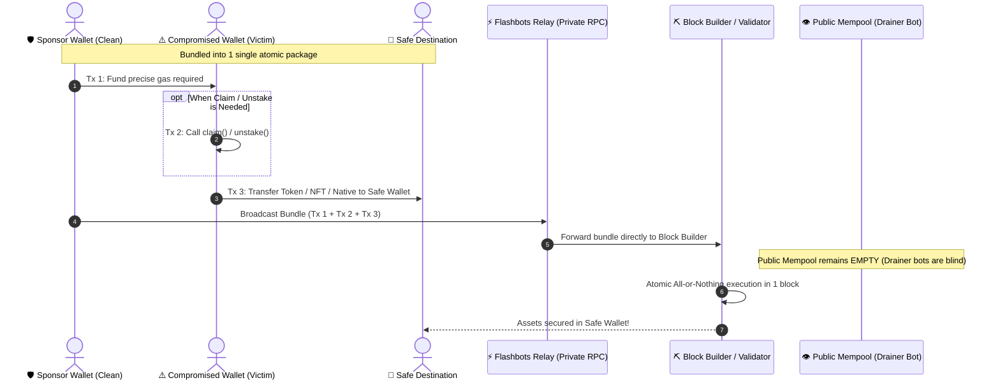
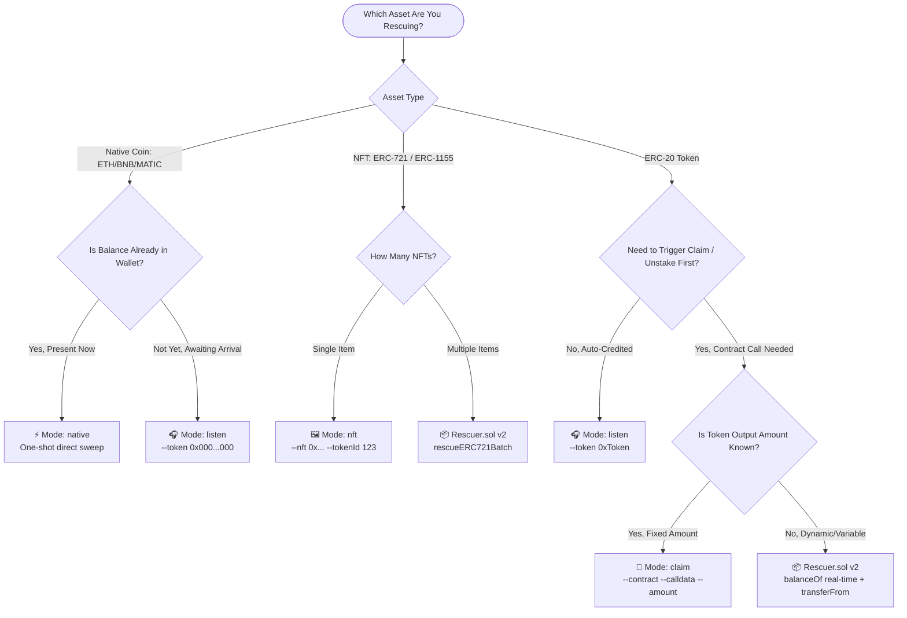
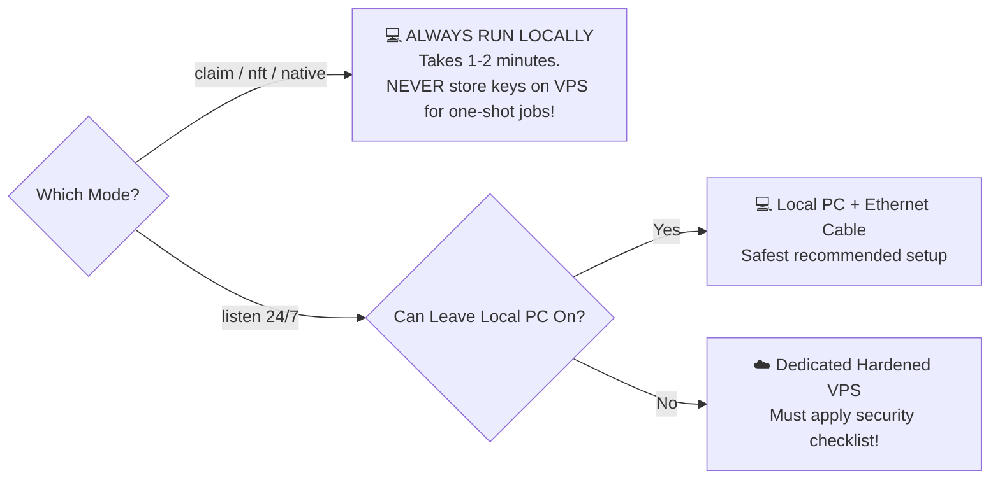

# 📘 Full Technical Guide (English)

## 1. Core Concept: Private Bundle vs Public Mempool

Normally, every transaction broadcast to an EVM network lands in the **public mempool** first — an open waiting pool monitored 24/7 by drainer bots. If you transfer native gas (ETH/BNB/MATIC) to a compromised wallet through standard transactions, the bot immediately spots the pending incoming tx and front-runs it, siphoning off the funds before your rescue operation can take place.

**Flashbots Bundles** eliminate this risk by:
1. Packaging the gas sponsorship transaction and the asset rescue/claim transactions into a **single atomic bundle**.
2. Sending the package **directly to block builders** through private RPC relays, completely bypassing the public mempool.
3. Guaranteeing an **all-or-nothing** execution: if any single transaction fails, the entire bundle reverts cleanly without leaving stray gas behind.

### Atomic Bundle Sequence Diagram



---

## 2. Mode Selection Decision Tree

Use this decision tree to pick the correct execution mode:



---

## 3. Local Execution vs Cloud VPS: Security Analysis & The Downsides

A critical engineering decision is whether to run the toolkit on your **Local Machine** or on a **Cloud VPS**.

> ⚠️ **Key Takeaway:** This is a trade-off between **high uptime** vs **private key exposure window**.

### Comparative Security Matrix

| Evaluation Factor | Local Machine (PC/Laptop) | Cloud VPS (Remote Server) |
|---|---|---|
| **Private Key Exposure** | 🟢 **Minimal**: Keys exist in RAM for seconds/minutes, then the process exits. | 🔴 **High**: Private keys reside on disk/memory 24/7 during extended listener sessions. |
| **Root & Memory Control** | 🟢 **100% Owned by You**: No external party has direct access to physical memory. | 🟡 **Third-Party Exposure**: VPS hypervisors/providers technically have memory dump access. |
| **Attack Surface** | 🟢 **Low**: Behind home NAT/firewall; no open public ports. | 🔴 **High**: Exposed to the public internet 24/7 (SSH brute-force, OS vulnerability scanners). |
| **Uptime Reliability** | 🟡 **Subject to Sleep/Power**: Laptop sleep or ISP drop could miss the target block. | 🟢 **99.9% Uptime**: Uninterrupted network connectivity. |
| **Relay Latency** | 🟡 **Variable (Home ISP)**: 30ms - 200ms depending on location. | 🟢 **Ultra-Low**: Can be hosted in regions adjacent to builders (e.g., Frankfurt/Virginia: 2-10ms). |

### The Real Downsides of Using a VPS

1. **Vastly Increased Exposure Window:**
   In `listen` mode, keeping `.env` with unencrypted keys on a remote server exposes them to credential scrapers, rogue server processes, or compromised dependencies.
2. **Configuration Neglect:**
   Many users leave SSH password login enabled on port 22 with default firewall settings. Unprotected VPS instances are frequently compromised within hours.
3. **Persistent Disk Artifacts:**
   Shell history (`~/.bash_history`), process managers (PM2 logs), and Linux swap partitions can inadvertently log private keys to disk.

### Deployment Rule of Thumb



1. **For `claim`, `nft`, and `native` modes**: **ALWAYS RUN LOCALLY.** Because these are one-shot executions taking 1–2 minutes, deploying them to a VPS introduces unnecessary attack vectors with zero upside.
2. **For `listen` mode**:
   - If you can keep your computer powered on with sleep mode disabled, **run it locally**.
   - If a VPS is mandatory (e.g., waiting days for an unlock while traveling):

#### 🛡️ Mandatory VPS Hardening Checklist:
- [ ] **Provision a Brand New VPS:** Never reuse a server hosting websites, databases, or public web apps.
- [ ] **Disable Password Authentication:** Enforce SSH key-based authentication (`PasswordAuthentication no` in `/etc/ssh/sshd_config`).
- [ ] **Configure Strict Firewall (`ufw`):**
  ```bash
  sudo ufw default deny incoming
  sudo ufw default allow outgoing
  sudo ufw allow 22/tcp  # or your custom SSH port
  sudo ufw enable
  ```
- [ ] **Disable Shell History Before Typing Secrets:**
  ```bash
  unset HISTFILE
  export HISTSIZE=0
  ```
- [ ] **Immediate Self-Destruct:** As soon as the rescue bundle succeeds, **DESTROY the VPS instance immediately** via your cloud dashboard (DigitalOcean/Linode/Hetzner). Do not leave dormant instances with leftover keys.

---

## 4. Scenario Walkthroughs

### Scenario 1 — Staking / Unstaking About to Unlock
```bash
npm run rescue -- --mode listen --token 0xTokenToRescue
```

### Scenario 2 — Manual Airdrop / Claim
```bash
# 1. Generate calldata interactively
npm run encode

# 2. Simulate via dry-run
npm run rescue -- --mode claim \
  --contract 0xClaimContract \
  --calldata 0xCalldata \
  --token 0xTokenAddress \
  --amount 1000 \
  --dry-run

# 3. Broadcast for real
npm run rescue -- --mode claim \
  --contract 0xClaimContract \
  --calldata 0xCalldata \
  --token 0xTokenAddress \
  --amount 1000
```
> ⚠️ **About `--amount`**: Before the bundle executes, the victim's balance is 0. You MUST supply `--amount` (or `--all` if tokens already reside in the wallet). The CLI refuses to execute without this check to prevent 0-token transfers.

### Scenario 3 — Automatic Vesting / Passive Release
Use `--mode listen` with the target token address.

### Scenario 4 — Native Coins (ETH / BNB / MATIC)
- **One-shot rescue (Balance present right now):**
  ```bash
  npm run rescue -- --mode native
  ```
- **Awaiting future native coin release:**
  ```bash
  npm run rescue -- --mode listen --token 0x0000000000000000000000000000000000000000
  ```

### Scenario 5 — NFTs (ERC-721 / ERC-1155)
```bash
# ERC-721
npm run rescue -- --mode nft --nft 0xNftContract --tokenId 1234 --standard erc721

# ERC-1155
npm run rescue -- --mode nft --nft 0xNftContract --tokenId 1234 --standard erc1155 --nftAmount 5
```

---

## 5. When to Use `Rescuer.sol` v2?

Use the smart contract helper when:
1. **Dynamic claim balances:** Reward distributions calculated on-chain at execution time. `Rescuer.sol` queries `balanceOf` dynamically on-chain right after the claim transaction succeeds.
2. **Batch Sweeps:** Sweeping multiple ERC-20 tokens or NFTs in a single transaction (`rescueERC20Batch`, `rescueERC721Batch`, `rescueERC1155Batch`).

```bash
# Compile contracts
npm run compile

# Run test suite (reproducing v1 bug & validating v2 fix)
npm test

# Deploy to Sepolia testnet
npm run deploy -- --network sepolia
```

---

## 6. Troubleshooting

| Symptom | Likely Cause | Resolution |
|---|---|---|
| Bundle never gets included | Priority gas too low | Raise `priorityGwei` in `planGas()` or increase builder tip |
| Simulation fails "insufficient funds" | Sponsor wallet underfunded | Ensure sponsor wallet has sufficient native balance (e.g. 0.02 - 0.05 ETH/BNB) |
| Transfer succeeds but amount is 0 | Forgot `--amount` in claim mode | Pass `--amount <value>` or use `Rescuer.sol` for dynamic balances |
| `claim()` keeps reverting | `msg.sender` mismatch in claim contract | Ensure direct EOA call instead of an intermediary contract proxy |
| WebSocket disconnects in `listen` mode | Public RPC timed out / rate limited | Use dedicated WebSocket providers like Alchemy, Infura, or QuickNode |

---

## ☕ Support & Donations

If this project helped protect or recover your assets, contributions are always greatly appreciated:

- **EVM (Ethereum, Base, Arbitrum, BSC, Polygon, etc.):**  
  `0xFCDD187D32cFaecD8B07638BD6004fA2bF6838C6`
- **Solana (SOL & SPL Tokens):**  
  `2zyBHgVYNp5WnKUK25WsdsQbsMzkj8Kzw2wDePWAnGZYS`
- **Sui:**  
  `0xfac84087048bf82f4f99c7704ee0cf9b1386c064b8ea845ab6baf65d1153eb09`
- **Bitcoin (BTC):**  
  `bc1qulgaaddxhl9qz5jcs4wu5tx5j3g9ng3lfd4cl0`
