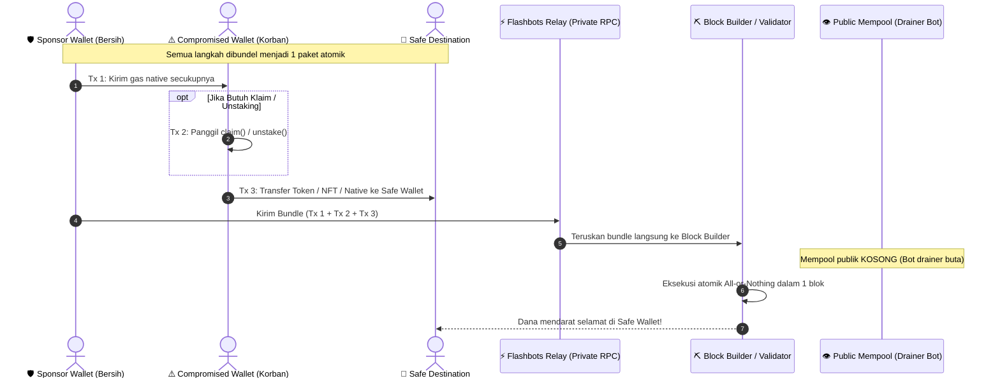
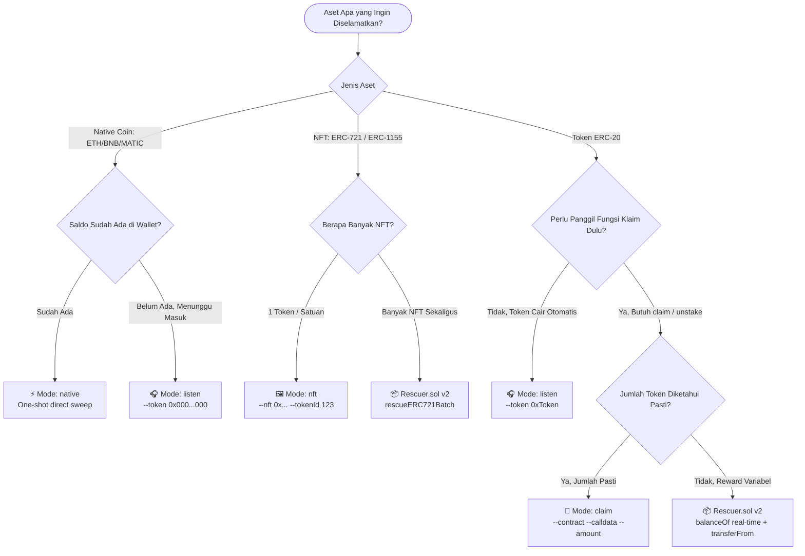
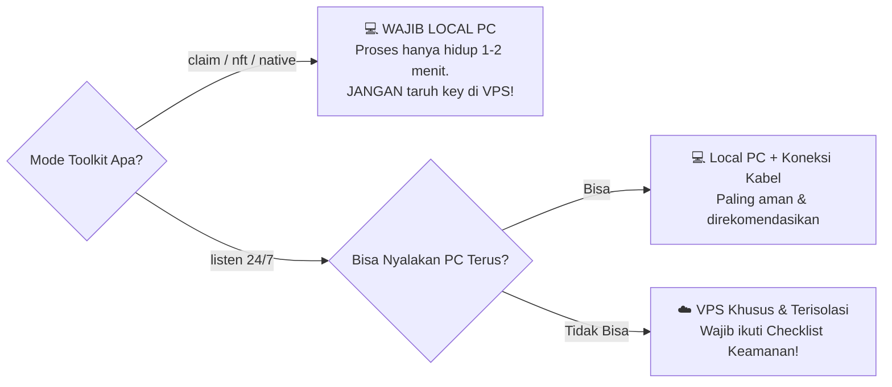

# 📘 Panduan Lengkap (Bahasa Indonesia)

`Author:` [@Prasetyo_HK](https://x.com/Prasetyo_HK) • `Status:` Active Development

## 1. Konsep Dasar: Private Bundle vs Public Mempool

Secara normal, setiap transaksi yang dikirim ke jaringan EVM masuk dulu ke **mempool publik** — ruang tunggu terbuka yang dipantau oleh drainer bot 24/7. Jika kamu mengirim gas (ETH/BNB/MATIC) ke wallet yang bocor melalui transaksi biasa, bot akan mendeteksi transaksi pending tersebut dan langsung memotongnya (*front-run*) sebelum kamu sempat menggunakannya untuk menyelamatkan aset.

**Flashbots Bundle** memecahkan masalah ini dengan cara:
1. Menggabungkan transaksi sponsor gas dan transaksi penyelamatan/klaim menjadi **satu paket atomik**.
2. Paket dikirim **langsung ke block builder** via jalur RPC privat tanpa pernah masuk ke mempool publik.
3. Builder **hanya mengeksekusi paket ini jika SELURUH transaksi di dalamnya berhasil**. Jika ada satu yang gagal, seluruh paket batal (*all-or-nothing*).

### Bagan Alur Transaksi Atomik (Sequence Diagram)



---

## 2. Pohon Keputusan (Decision Tree) Pemilihan Mode

Gunakan diagram ini agar tidak salah memilih mode penyelamatan:



---

## 3. Penjelasan Lengkap Variabel `.env`, RPC HTTP, WSS, & Private Relay

Memahami setiap konfigurasi pada file `.env` sangat penting agar Anda tidak salah memasukkan data atau bingung mencari endpoint:

### A. Perbedaan 3 Jenis Endpoint
1. **`RPC_HTTP_URL` (Regular HTTP/HTTPS RPC):**
   - **Fungsi:** Untuk **membaca** data on-chain secara statis: memeriksa saldo token di wallet korban, mengambil nonce transaksi, membaca decimals token, dan menghitung estimasi base gas.
   - **Kapan Dipakai:** Selalu aktif di seluruh mode (`claim`, `listen`, `nft`, `native`).
2. **`RPC_WSS_URL` (WebSocket RPC - `wss://`):**
   - **Fungsi:** Saluran komunikasi real-time 2 arah. Node blockchain akan langsung "menembak" notifikasi ke terminal Anda saat ada blok baru yang ditambang (<50 milidetik).
   - **Kapan Dipakai:** **Wajib khusus mode `listen`** (auto-sweeper pasif). Tanpa WSS, script tidak bisa memantau blok secara instan.
3. **`FLASHBOTS_RELAY_URL` (Private Relay Endpoint):**
   - **Fungsi:** Gerbang privat langsung menuju Block Builder / Penambang MEV.
   - **Kapan Dipakai:** Saat bundle penyelamatan **dikirim (broadcast)**. Transaksi Anda **TIDAK PERNAH masuk ke mempool publik**, sehingga bot drainer yang memantau wallet Anda tidak bisa melihat apa pun sebelum transaksi sah masuk ke dalam blok.
   - *Mainnet:* `https://relay.flashbots.net` | *Sepolia:* `https://relay-sepolia.flashbots.net`

### B. Di Mana Mengambil RPC (HTTP & WSS) dan Berapa Biayanya?
> 💰 **BIAYANYA 100% GRATIS!** Anda tidak perlu membayar layanan berbayar apa pun.

- **[Alchemy.com](https://www.alchemy.com/):**
  1. Buat akun gratis.
  2. Buka menu **Apps** $\to$ Klik **Create App** (pilih chain seperti Ethereum / Sepolia / Base).
  3. Klik **API Key**:
     - Salin link **HTTPS** untuk `RPC_HTTP_URL`.
     - Klik tab **WebSockets** dan salin link **WSS** untuk `RPC_WSS_URL`.
  *(Free tier Alchemy menyediakan 300 juta Compute Units per bulan, sangat cukup untuk ribuan transaksi).*
- **Public RPC Sepolia:** Jika hanya ingin latihan di Sepolia, Anda bisa menggunakan `https://rpc.sepolia.org` secara gratis tanpa daftar.

### C. Penjelasan 4 Kunci Wallet di `.env`
1. `COMPROMISED_PRIVATE_KEY`: Kunci privat wallet korban yang bocor (tempat aset tertahan).
2. `SPONSOR_PRIVATE_KEY`: Kunci privat wallet bersih yang berisi saldo native ETH/BNB untuk mendanai gas.
3. `SAFE_DESTINATION_ADDRESS`: Alamat publik (`0x...`) wallet aman baru tempat aset dikirimkan.
4. `FLASHBOTS_AUTH_SIGNER_KEY`: Kunci privat wallet acak baru (boleh saldo 0). Hanya digunakan Flashbots sebagai identitas kriptografis untuk mencegah spam serangan DoS ke relay.

### D. Apakah Perlu RPC Berbayar (Premium) Agar Cepat?
> 🚀 **TIDAK PERLU SAMA SEKALI!** Membayar langganan RPC premium puluhan hingga ratusan dollar adalah pemborosan.

1. **Latensi Normal Identik:** Dalam kondisi jaringan normal, latensi respons akun gratis dan berbayar praktis identik (~10–30ms) karena berada di infrastruktur edge yang sama. Perbedaan baru terasa saat jaringan sedang padat (misal ada mint NFT viral atau volatilitas pasar tinggi) — pada situasi ini provider bisa menerapkan *rate limiting per detik* yang lebih ketat untuk akun gratis. Untuk pemakaian toolkit ini (eksekusi sesekali, bukan bot HFT), efeknya biasanya dapat diabaikan.
2. **Kuota Sangat Melimpah:** Kuota gratis 300 juta Compute Units/bulan dari Alchemy sudah cukup untuk jutaan blok pemantauan.
3. **Relay Flashbots Memang Terbuka & Gratis:** Pintu masuk `https://relay.flashbots.net` tidak memiliki antrean VIP berbayar.
4. **Penyebab Bundle Gagal:** Perlu diingat juga bahwa kegagalan bundle masuk blok tidak selalu berarti tip Anda kurang. Penyebab lain yang umum: builder tertentu sedang tidak menyertakan bundle jenis tersebut, atau ada searcher/whitehat lain yang menargetkan calldata yang sama (*race condition*), terutama pada kasus airdrop atau eksploit yang sedang ramai diburu.

#### ⚡ Solusi Terbaik: Multi-Relay Builder Broadcast
Toolkit ini secara otomatis membroadcast bundle ke 4 builder teratas di Ethereum:
- **Flashbots Relay** (`relay.flashbots.net`)
- **Titan Builder** (`rpc.titanbuilder.xyz`)
- **BeaverBuild** (`rpc.beaverbuild.org`)
- **Rsync Builder** (`rsync-builder.xyz`)

Langkah ini melipatgandakan peluang inklusi ke dalam blok hingga **>85% per blok** tanpa biaya tambahan!

---

## 4. Local (PC Sendiri) vs VPS: Analisis Keamanan & Sisi "Ga Enak"-nya

Pertanyaan paling sering muncul: *"Apakah harus sewa VPS atau jalankan di laptop/PC sendiri?"*

Jawabannya: **Ini adalah pertukaran serius antara kenyamanan uptime vs risiko keamanan kunci privat.**

### Tabel Perbandingan Risiko

| Faktor Pertimbangan | Jalankan di Local (Laptop/PC) | Jalankan di VPS Cloud Server |
|---|---|---|
| **Paparan Private Key** | 🟢 **Sangat Aman**: Key hanya dimuat di RAM PC kamu selama beberapa detik/menit saat proses berjalan. | 🔴 **Berisiko Tinggi**: Private key harus tersimpan di disk/RAM server selama proses berjalan (jam-jaman / 24/7). |
| **Akses Root & Hardware** | 🟢 **100% Kendali Kamu**: Tidak ada pihak ketiga yang memiliki akses ke memori fisik. | 🟡 **Akses Provider**: Pihak hosting (secara teknis) atau attacker dengan exploit kernel dapat mendump memori server. |
| **Attack Surface (Celah Serang)** | 🟢 **Minim**: Tidak membuka port publik ke internet. | 🔴 **Tinggi**: Server terekspos IP publik 24/7 (target scanning bot, SSH brute-force, exploit OpenSSL/OS). |
| **Uptime (Kestabilan Nyala)** | 🟡 **Tergantung PC**: Jika laptop sleep, mati lampu, atau WiFi putus, blok airdrop bisa terlewat. | 🟢 **99.9% Uptime**: Server menyala terus tanpa henti. |
| **Latensi ke Flashbots Relay** | 🟡 **Tergantung ISP**: Ping dari internet rumahan bervariasi (30ms - 200ms). | 🟢 **Ultra Rendah**: Bisa pilih server di region dekat builder (misal Frankfurt / Virginia: 2-10ms). |

### Sisi "Ga Enak"-nya Pakai VPS

1. **Jendela Serangan (Exposure Window) Sangat Panjang:**
   Pada mode `listen`, toolkit harus terus hidup menunggu token landing. Menaruh `.env` berisi private key di VPS membuat key Anda terancam jika server Anda di-hack.
2. **Kecolongan Akibat Konfigurasi Teledor:**
   Banyak orang lupa mengamankan SSH (tetap pakai password lemah, port default 22 terbuka, tanpa firewall). Scanner bot di internet bisa membobol VPS dalam hitungan jam.
3. **Ketergantungan Disk Log & History:**
   Command history (`~/.bash_history`), log PM2, atau file swap di VPS bisa secara tidak sengaja merekam private key yang Anda ketikkan.

### Rekomendasi & Aturan Penggunaan



1. **Untuk mode `claim`, `nft`, dan `native`**: **100% JALANKAN DI LOCAL.** Karena prosesnya hanya butuh 1 kali tembak (selesai dalam 1–2 menit), menaruh private key di VPS adalah tindakan ceroboh tanpa keuntungan apa pun.
2. **Untuk mode `listen`**:
   - Jika Anda bisa menyalakan laptop/PC dan menonaktifkan mode Sleep, **tetap jalankan di Local**.
   - Jika kondisi memaksa harus pakai VPS (misal token baru akan keluar 3 hari lagi di jam subuh):

#### 🛡️ Checklist Wajib Jika Terpaksa Menggunakan VPS:
- [ ] **Gunakan VPS Baru & Bersih:** Jangan gunakan VPS yang sudah terpasang website WordPress, bot trading, atau aplikasi lain.
- [ ] **Matikan Password Authentication:** Login SSH WAJIB menggunakan SSH Key (`ssh-copy-id`). Matikan login password (`PasswordAuthentication no` di `/etc/ssh/sshd_config`).
- [ ] **Aktifkan Firewall Ketat (`ufw`):**
  ```bash
  sudo ufw default deny incoming
  sudo ufw default allow outgoing
  sudo ufw allow 22/tcp  # atau custom port SSH kamu
  sudo ufw enable
  ```
- [ ] **Hapus Riwayat Terminal & File Sensitive:** Matikan history shell sebelum mengetik key:
  ```bash
  unset HISTFILE
  export HISTSIZE=0
  ```
- [ ] **Self-Destruct Setelah Selesai:** Begitu token berhasil diselamatkan, **segera DESTROY / HAPUS VPS tersebut** dari dashboard provider (DigitalOcean/Linode/Hetzner). Jangan biarkan server menganggur dengan key masih tersisa di disk.

---

## 4. Studi Kasus per Skenario

### Skenario 1 — Staking / Unstaking yang akan unlock
**Masalah**: Anda punya posisi staking di wallet bocor. Begitu masa lock berakhir, saldo token langsung muncul.
**Solusi**:
```bash
npm run rescue -- --mode listen --token 0xAlamatTokenHasilUnstake
```

### Skenario 2 — Airdrop / Klaim Manual
**Masalah**: Ada fungsi `claim()` yang harus dipanggil terlebih dahulu sebelum token muncul.
**Solusi**:
```bash
# 1. Generate calldata interaktif
npm run encode

# 2. Jalankan simulasi terlebih dahulu
npm run rescue -- --mode claim \
  --contract 0xClaimContractAddress \
  --calldata 0xHasilCalldata \
  --token 0xTokenAddress \
  --amount 1000 \
  --dry-run

# 3. Eksekusi nyata
npm run rescue -- --mode claim \
  --contract 0xClaimContractAddress \
  --calldata 0xHasilCalldata \
  --token 0xTokenAddress \
  --amount 1000
```
> ⚠️ **PENTING soal `--amount`:** Karena saldo sebelum bundle dieksekusi masih 0, Anda WAJIB menyertakan nilai `--amount` (atau flag `--all` jika token sudah ada di wallet). Jika tidak diisi, toolkit akan menolak berjalan demi mencegah pengiriman transfer 0 token.

### Skenario 3 — Airdrop / Vesting Otomatis (Passive)
**Masalah**: Token masuk otomatis kapan saja.
**Solusi**: Gunakan `--mode listen` dengan target token terkait.

### Skenario 4 — Native Coin (ETH/BNB/MATIC)
- **Kasus A (Saldo sudah ada di wallet sekarang):**
  ```bash
  npm run rescue -- --mode native
  ```
- **Kasus B (Menunggu saldo native masuk di masa depan):**
  ```bash
  npm run rescue -- --mode listen --token 0x0000000000000000000000000000000000000000
  ```

### Skenario 5 — NFT (ERC-721 / ERC-1155)
```bash
# ERC-721
npm run rescue -- --mode nft --nft 0xKontrakNFT --tokenId 1234 --standard erc721

# ERC-1155
npm run rescue -- --mode nft --nft 0xKontrakNFT --tokenId 1234 --standard erc1155 --nftAmount 5
```

---

## 5. Kapan Menggunakan Smart Contract `Rescuer.sol` v2?

Gunakan kontrak bantu `Rescuer.sol` jika:
1. **Jumlah token klaim tidak dapat diprediksi sebelumnya** (misal reward staking dinamis atau kalkulasi on-chain variabel). Kontrak membaca `balanceOf` korban secara **real-time on-chain** tepat setelah fungsi klaim berhasil dieksekusi dalam bundle yang sama.
2. **Penyelamatan Batch:** Menyelamatkan banyak token atau banyak NFT sekaligus dalam 1 transaksi tunggal (`rescueERC20Batch`, `rescueERC721Batch`, `rescueERC1155Batch`).

### Mengapa v2 Berbeda dari v1?
- Pada versi v1 lama, kontrak memanggil klaim dari dalam kontrak perantara (`claimTarget.call(...)`). Ini gagal di mayoritas protokol karena protokol membaca `msg.sender` sebagai alamat kontrak, bukan wallet korban.
- Pada **v2**, wallet korban memanggil `claim()` secara langsung dari EOA-nya (sehingga `msg.sender` sah), kemudian memanggil `approve()` ke kontrak `Rescuer`, dan kontrak `Rescuer` mengeksekusi `transferFrom` seluruh saldo yang terbentuk secara on-chain.

```bash
# Compile
npm run compile

# Uji Test Suite (Validasi bug v1 vs fix v2)
npm test

# Deploy ke Sepolia Testnet
npm run deploy -- --network sepolia
```

---

## 6. Latihan Aman di Sepolia Testnet

Sebelum menyentuh dana nyata di mainnet, **sangat disarankan berlatih terlebih dahulu di Sepolia Testnet**. Flashbots menyediakan relay publik resmi untuk Sepolia (`https://relay-sepolia.flashbots.net`) sehingga Anda bisa menguji seluruh alur bundle tanpa mengeluarkan uang sepeser pun.

### Langkah 1: Dapatkan Sepolia ETH Gratis
Isi saldo **Sponsor Wallet** dengan sedikit Sepolia ETH (0.05 ETH sudah lebih dari cukup):
- [Google Cloud Sepolia Faucet](https://cloud.google.com/application/web3/faucet/ethereum/sepolia)
- [Alchemy Sepolia Faucet](https://sepoliafaucet.com/)
- [PoW Faucet Sepolia](https://sepolia-faucet.pk910.de/)

### Langkah 2: Konfigurasi `.env` untuk Sepolia
```env
CHAIN_ID=11155111
RPC_HTTP_URL=https://rpc.sepolia.org
SEPOLIA_RPC_URL=https://rpc.sepolia.org
FLASHBOTS_RELAY_URL=https://relay-sepolia.flashbots.net

COMPROMISED_PRIVATE_KEY=0x... (Private key wallet latihan yang berpura-pura bocor)
SPONSOR_PRIVATE_KEY=0x...     (Private key wallet bersih yang berisi Sepolia ETH)
SAFE_DESTINATION_ADDRESS=0x... (Alamat wallet aman penampung aset)
FLASHBOTS_AUTH_SIGNER_KEY=0x... (Private key sembarang baru untuk reputasi relay)
```

### Langkah 3: Setup Kontrak Mock Otomatis di Sepolia
Jalankan perintah ini:
```bash
npm run testnet:setup
```
Script otomatis ini akan:
1. Men-deploy `MockToken` ($MRT) ke Sepolia.
2. Men-deploy kontrak klaim `MockStaking` ke Sepolia.
3. Mendaftarkan wallet korban ke posisi stake (saldo awal = 0).
4. Mencetak perintah CLI lengkap yang siap Anda jalankan!

### Langkah 4: Eksekusi Penyelamatan Latihan
```bash
# 1. Uji simulasi (dry-run) tanpa broadcast:
npm run rescue -- --mode claim --contract <ALAMAT_STAKING> --calldata 0x4e71d92d --token <ALAMAT_TOKEN> --amount 1000 --dry-run

# 2. Eksekusi nyata di Sepolia:
npm run rescue -- --mode claim --contract <ALAMAT_STAKING> --calldata 0x4e71d92d --token <ALAMAT_TOKEN> --amount 1000
```
Setelah berhasil masuk ke dalam blok Sepolia, Anda dapat mengecek explorer [Sepolia Etherscan](https://sepolia.etherscan.io) bahwa 1000 MRT telah berhasil diselamatkan ke `SAFE_DESTINATION_ADDRESS`!

---

## 7. Troubleshooting Umum

| Gejala | Kemungkinan Penyebab | Solusi |
|---|---|---|
| Bundle terus gagal masuk block | Priority gas terlalu rendah | Naikkan `priorityGwei` di `planGas()` atau atur tip lebih tinggi |
| Simulasi gagal "insufficient funds" | Sponsor wallet kurang saldo | Pastikan sponsor wallet memiliki saldo gas native yang cukup (minimal 0.02 - 0.05 ETH/BNB) |
| Transfer sukses tapi jumlah 0 | Lupa isi `--amount` di mode claim | Gunakan `--amount <jumlah>` atau kontrak `Rescuer.sol` jika jumlah dinamis |
| `claim()` revert terus | `msg.sender` tidak sesuai atau caller salah | Pastikan tidak memanggil via proxy kontrak perantara; gunakan EOA langsung atau pola Rescuer v2 |
## 8. Panduan Pemula: Minta Bimbingan AI Agent (Gemini / Claude / ChatGPT)

Bagi pengguna non-teknis atau pemula yang baru pertama kali menghadapi insiden wallet bocor:
Jika Anda bingung menentukan function signature, menyusun calldata klaim, atau memilih mode penyelamatan yang tepat, Anda dapat meminta bimbingan interaktif kepada **Agent AI (seperti Google Gemini, Anthropic Claude, atau ChatGPT)**.

> 🔴 **PERINGATAN KERAS KEAMANAN:**  
> **JANGAN PERNAH menempelkan Private Key asli Anda ke dalam chat AI mana pun!**  
> AI TIDAK membutuhkan private key Anda untuk membantu membuat calldata atau perintah CLI. Cukup gunakan placeholder seperti `0x1111...1111` atau nama simbolik.

### 📋 Template Pertanyaan untuk AI Agent:

Salin teks berikut dan berikan ke AI Anda:

```text
Halo, wallet EVM saya bocor dan saya sedang menggunakan repositori whitehat "EVM Rescue Toolkit" (berbasis Flashbots bundle).
Tolong pandu saya langkah demi langkah secara ramah pemula untuk kasus berikut:

1. Jenis Aset: [Sebutkan: Token ERC-20 / NFT ERC-721 / Saldo Native ETH / BNB]
2. Alamat Kontrak Token/NFT: [Tempel alamat kontrak target]
3. Skenario: [Contoh: Mau klaim staking reward dari smart contract / Menunggu airdrop unlock]
4. Nama Fungsi di Explorer: [Contoh: claim() / withdraw() / unstake(uint256)]

Tolong berikan:
a. Perintah encoder atau calldata heksadesimal yang harus saya pakai.
b. Perintah CLI lengkap (`npm run rescue -- ...`) yang siap saya salin ke terminal.
Catatan: Saya tidak akan memberikan private key saya demi alasan keamanan.
```

---

<a id="faq-threat-model-time-locked"></a>
## 9. ⏳ FAQ & Threat Model: Skenario Aset Terikat Waktu & Syarat Khusus

Bagian ini menjelaskan skenario-skenario di mana aset **tidak bisa langsung diselamatkan dalam satu bundle atomik**, karena ada jeda waktu (*time delay*) atau syarat pihak ketiga yang harus dipenuhi terlebih dahulu.

> [!IMPORTANT]
> **Prinsip Dasar: Aksi Instan vs Menunggu Waktu**  
> Toolkit ini dirancang optimal untuk aksi yang bisa dieksekusi **instan dalam satu blok** (Klaim $\rightarrow$ Transfer ke Safe Wallet).  
> Begitu ada faktor waktu tunggu (menit, jam, atau hari), strategi penyelamatan berubah dari *"eksekusi sekali jalan"* menjadi *"pantau lalu eksekusi tepat saat window terbuka"*.
>
> Selama compromised wallet hanya dipantau pasif oleh bot drainer (menunggu saldo native gas masuk untuk langsung disapu), toolkit **tetap efektif** menyelamatkan aset di titik waktu ketika aset tersebut akhirnya cair — asalkan bundle atomik dieksekusi tepat pada window waktu tersebut.

---

### 1. Airdrop Non-Transferable (Menunggu Dev Mengaktifkan Transfer)

* **Situasi:** Anda sudah klaim airdrop dan token sudah tercatat di saldo wallet (`balanceOf` ada saldo), tetapi smart contract token memiliki flag internal seperti `transfersEnabled = false` yang membuat fungsi `transfer()` selalu revert hingga developer membukanya (biasanya setelah TGE atau listing CEX).
* **Kenapa Toolkit Tidak Bisa Membantu Saat Ini:** Transaksi transfer akan selalu *revert* terlepas dari berapa pun gas atau priority tip yang Anda berikan. Ini bukan masalah kecepatan atau gas, melainkan pembatasan logika smart contract token itu sendiri.
* **Solusi & Strategi Taktis:**
  1. **Pantau kontrak token, bukan wallet Anda:** Cek fungsi publik seperti `transfersEnabled()`, `paused()`, atau event log `TransfersEnabled` di block explorer.
  2. **Gunakan mode `listen` yang dimodifikasi:** Ubah pengecekan script `listen` agar memantau kembalian boolean `transfersEnabled()` alih-alih `balanceOf()`.
  3. **Eksekusi instan begitu aktif:** Begitu flag berubah menjadi `true`, segera kirim bundle atomik di blok yang sama karena drainer kemungkinan besar juga memonitor hal yang sama.
  4. **Jangan sentuh allowance:** Hindari interaksi approval apa pun ke pihak luar selama masa tunggu.
* **Keterbatasan Nyata:** Jika developer membuka transfer secara bertahap (whitelist batch) tanpa transparansi jadwal, Anda harus menjalankan monitoring dengan uptime yang stabil di PC lokal.

---

### 2. Token Locked dengan Auto-Unlock Pasti (Vesting / Lock Schedule)

* **Situasi:** Token Anda terkunci di kontrak lock (misalnya TeamFinance, PinkLock, UNCX, atau kontrak vesting proyek) dengan jadwal unlock otomatis berdasarkan timestamp blok (`block.timestamp >= unlockTime`).
* **Perbedaan Penting:** Waktu unlock di sini bersifat **deterministik dan publik** — siapa pun bisa membaca `unlockTime()` di explorer.
* **Solusi & Strategi Taktis:**
  1. **Baca smart contract:** Panggil fungsi baca seperti `unlockTime()`, `releaseTime()`, atau `vestingSchedule()`.
  2. **Hitung mundur waktu unlock:** Jadwalkan eksekusi beberapa detik menjelang detik unlock (bukan sesudahnya).
  3. **Gunakan mode `claim`:** Arahkan calldata ke fungsi `release()` atau `withdraw()` milik kontrak lock, dirangkai dalam bundle yang sama dengan transfer ke safe destination.
  4. **Multi-Relay Broadcast:** Karena bot drainer juga mengetahui timestamp publik ini, terjadi *race condition* di blok unlock. Pengiriman bundle ke **Flashbots + Titan + BeaverBuild + Rsync** sekaligus sangat krusial untuk memenangkan blok tersebut.
* **Keterbatasan Nyata:** Jika bot drainer memasang bundle otomatis dengan priority tip yang jauh lebih ekstrem persis di blok unlock, Anda bisa kalah murni akibat persaingan gas/tip. Tingkatkan `priorityGwei` secara agresif untuk momen unlock publik ini.

---

### 3. Token Unstaking dengan Delay Timer / Cooldown Period

* **Situasi:** Anda memanggil `unstake()` atau `requestWithdrawal()`, tetapi protokol menerapkan masa cooldown (misal 7–21 hari pada liquid staking atau lending) sebelum token bisa ditarik lewat `claimWithdrawal()` atau `completeUnstake()`.
* **Strategi Dua Tahap (2x Eksekusi Terpisah, Bukan 1 Command Otomatis):**
  * **Tahap A — Mengajukan Permintaan Unstake (Sekarang):**  
    Jalankan bundle atomik mode `claim` untuk memanggil `requestWithdrawal()`:
    * Tx 1: Sponsor kirim native gas.
    * Tx 2: Panggil `unstake()`.  
    * *Catatan:* Tidak ada aset yang berpindah ke safe wallet di tahap ini, risikonya sangat minim.
  * **Tahap B — Menarik Aset Pasca Cooldown Selesai (Nanti):**  
    Setelah `readyTimestamp` tercapai, jalankan bundle atomik kedua secara manual:
    * Tx 1: Sponsor kirim gas.
    * Tx 2: Panggil `completeUnstake()`.
    * Tx 3: Transfer token ke safe wallet.
* **Keterbatasan Nyata:** Toolkit tidak dapat mempercepat periode cooldown jaringan. Anda wajib menunggu waktu cooldown selesai secara alami.

---

### 4. Matriks Keputusan: Kapan Toolkit Efektif vs Kapan Harus Menunggu

| Skenario | Bisa Eksekusi Sekarang? | Strategi Penyelamatan | Mode Toolkit |
| :--- | :---: | :--- | :--- |
| **Airdrop Siap Klaim** (Tanpa gas) | ✅ **Langsung** | Bundle atomik 1x jalan (Sponsor + Klaim + Transfer) | `npm run rescue -- --mode claim` |
| **Airdrop Non-Transferable** (Nunggu Dev) | ❌ **Tunggu Dev** | Pantau state kontrak (`transfersEnabled`), eksekusi instan saat aktif | Modifikasi `npm run rescue -- --mode listen` |
| **Token Locked / Vesting** (Waktu Pasti) | ⏳ **Tepat Waktu** | Hitung mundur block timestamp, tembak bundle + multi-relay | `npm run rescue -- --mode claim` (Target: Lock) |
| **Unstaking Cooldown** (Delay 7-21 Hari) | ⏳ **2 Tahap Terpisah** | **2x eksekusi manual terpisah**: Tahap 1 ajukan unstake, Tahap 2 tarik & sweep setelah cooldown | `npm run rescue -- --mode claim` (2x beda waktu) |
| **Malicious Allowance Aktif** | ⚠️ **Bahaya** | Wajib cabut (revoke) izin jahat sebelum/dalam bundle | Revoke + Transfer |

---

### 5. 6 Skenario Tambahan yang Sering Terlewat

> [!WARNING]
> **PERINGATAN KRUSIAL: Malicious Allowance (Persetujuan Jahat) adalah Risiko Aktif!**  
> Skenario ini berbeda dari kasus penundaan waktu biasa: jika wallet Anda pernah menandatangani `approve()` atau `setApprovalForAll()` ke smart contract drainer, drainer dapat menarik token Anda via `transferFrom()` secara instan begitu saldo muncul — bahkan tanpa perlu memantau mempool!  
> **Langkah Wajib:** Cek seluruh approval aktif di [Revoke.cash](https://revoke.cash) atau explorer. Jika ada approval jahat, bundle atomik Anda wajib menyertakan transaksi `approve(drainer, 0)` sebelum transaksi pemindahan aset.

#### a. Vesting Linear (Bertahap, Bukan Sekali Unlock)
Beberapa protokol tidak membuka token 100% sekaligus, melainkan bertahap sedikit demi sedikit per hari atau per blok.  
* **Tindakan:** Jangan menunggu hingga 100% terkumpul. Jalankan sweep berkala untuk setiap porsi yang bisa ditarik (`releasableAmount() > 0`) agar drainer tidak mencuri tetesan token tersebut satu per satu.

#### b. Snapshot / Whitelist Berbasis Block Height
Beberapa airdrop menolak klaim (`revert: not eligible`) jika dipanggil sebelum nomor blok snapshot tertentu diaktifkan on-chain.  
* **Tindakan:** Verifikasi eligibilitas via fungsi baca `isEligible(address)` di explorer sebelum mengeksekusi CLI.

#### c. Klaim yang Membutuhkan Kepemilikan NFT Tertentu (Gated Claim)
Jika airdrop hanya bisa diklaim oleh pemegang NFT tertentu dan NFT tersebut berada di compromised wallet:  
* **Tindakan:** Amankan NFT terlebih dahulu menggunakan `npm run rescue -- --mode nft`, baru jalankan klaim token jika fungsi klaim memvalidasi kepemilikan NFT pada saat pemanggilan.

#### d. Klaim Lintas-Chain (Cross-Chain Airdrop)
Jika klaim dilakukan di satu chain (misal Ethereum) tetapi aset cair di chain lain (misal Arbitrum):  
* **Tindakan:** Toolkit tidak bisa menggabungkan transaksi multi-chain dalam 1 bundle privat (batasan arsitektur Flashbots). Anda harus menjalankan proses terpisah pada masing-masing chain dengan RPC dan sponsor gas yang sesuai.

#### e. Gas Spike Antara Waktu Simulasi dan Eksekusi
Jika ada jeda waktu lama antara `--dry-run` dan eksekusi nyata (karena menunggu jam unlock):  
* **Tindakan:** *Base fee* jaringan bisa melonjak tinggi. Selalu jalankan ulang `--dry-run` 10–30 detik sebelum eksekusi riil, dan siapkan buffer saldo native pada sponsor wallet 20–30% lebih tinggi dari estimasi.

#### f. Batasan Mutlak Smart Contract Lainnya
1. **Token dengan Blacklist Function (USDT, USDC):** Jika alamat korban sudah diblacklist oleh penerbit token, `transfer()` akan selalu revert.
2. **Kontrak yang Sedang Di-Pause:** Jika fungsi dinonaktifkan oleh admin (`whenNotPaused`), bundle akan gagal simulasi.
3. **Token Pajak Ekstrem / Honeypot:** Token dengan potongan pajak tinggi atau transfer terlarang akan gagal dikirim ke safe wallet.
4. **Aset Sudah Ditransfer Keluar Sebelumnya:** Jika drainer sudah menguras aset sebelum toolkit dijalankan, transaksi blockchain bersifat permanen dan tidak bisa dibatalkan.

---

### 6. Kesimpulan & Rekomendasi Taktis

* **Aset Cair Instan:** Gunakan mode `claim`, `nft`, atau `native` untuk eksekusi 1-blok yang cepat dan bersih.
* **Jadwal Pasti (Lock/Cooldown):** Pasang alarm, lakukan dry-run sesaat sebelum jadwal, dan gunakan multi-relay broadcast untuk memenangkan blok unlock.
* **Tergantung Pihak Ketiga (Dev Switch):** Gunakan mode pemantauan aktif (`listen`) di PC lokal dengan uptime terjaga.
* **Wallet Terpapar Allowance:** Segera audit via [Revoke.cash](https://revoke.cash) sebelum melakukan penyelamatan apa pun.

---

## ☕ Support & Donations

Jika toolkit ini membantu menyelamatkan aset berharga Anda, kontribusi dan donasi sangat diapresiasi:

- **EVM (Ethereum, Base, Arbitrum, BSC, Polygon, dll):**  
  `0xFCDD187D32cFaecD8B07638BD6004fA2bF6838C6`
- **Solana (SOL & SPL Tokens):**  
  `2zyBHgVYNp5WnKUK25WsdsQbsMzkj8Kzw2wDePWAnGZYS`
- **Sui:**  
  `0xfac84087048bf82f4f99c7704ee0cf9b1386c064b8ea845ab6baf65d1153eb09`
- **Bitcoin (BTC):**  
  `bc1qulgaaddxhl9qz5jcs4wu5tx5j3g9ng3lfd4cl0`
