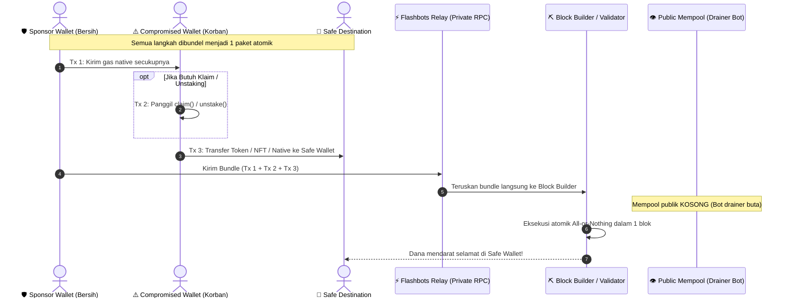
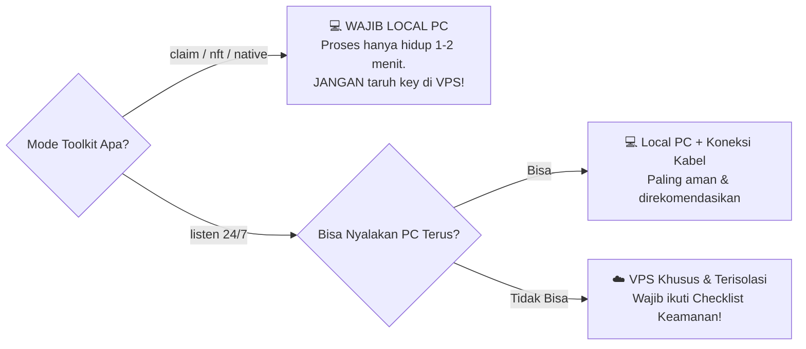

# 📘 Panduan Lengkap (Bahasa Indonesia)

`Author:` [@Prasetyo_HK](https://x.com/Prasetyo_HK) • `Status:` Active Development

## 1. Konsep Dasar: Private Bundle vs Public Mempool

Secara normal, setiap transaksi yang dikirim ke jaringan EVM masuk dulu ke **mempool publik** — ruang tunggu terbuka yang dipantau oleh drainer bot 24/7. Jika kamu mengirim gas (ETH/BNB/MATIC) ke wallet yang bocor melalui transaksi biasa, bot akan mendeteksi transaksi pending tersebut dan langsung memotongnya (*front-run*) sebelum kamu sempat menggunakannya untuk menyelamatkan aset.

**Flashbots Bundle** memecahkan masalah ini dengan cara:
1. Menggabungkan transaksi sponsor gas dan transaksi penyelamatan/klaim menjadi **satu paket atomik**.
2. Paket dikirim **langsung ke block builder** via jalur RPC privat tanpa pernah masuk ke mempool publik.
3. Builder **hanya mengeksekusi paket ini jika SELURUH transaksi di dalamnya berhasil**. Jika ada satu yang gagal, seluruh paket batal (*all-or-nothing*).

### Bagan Alur Transaksi Atomik (Sequence Diagram)



---

## 2. Pohon Keputusan (Decision Tree) Pemilihan Mode

Gunakan diagram ini agar tidak salah memilih mode penyelamatan:


---

## 3. Local (PC Sendiri) vs VPS: Analisis Keamanan & Sisi "Ga Enak"-nya

Pertanyaan paling sering muncul: *"Apakah harus sewa VPS atau jalankan di laptop/PC sendiri?"*

Jawabannya: **Ini adalah pertukaran serius antara kenyamanan uptime vs risiko keamanan kunci privat.**

### Tabel Perbandingan Risiko

| Faktor Pertimbangan | Jalankan di Local (Laptop/PC) | Jalankan di VPS Cloud Server |
|---|---|---|
| **Paparan Private Key** | 🟢 **Sangat Aman**: Key hanya dimuat di RAM PC kamu selama beberapa detik/menit saat proses berjalan. | 🔴 **Berisiko Tinggi**: Private key harus tersimpan di disk/RAM server selama proses berjalan (jam-jaman / 24/7). |
| **Akses Root & Hardware** | 🟢 **100% Kendali Kamu**: Tidak ada pihak ketiga yang memiliki akses ke memori fisik. | 🟡 **Akses Provider**: Pihak hosting (secara teknis) atau attacker dengan exploit kernel dapat mendump memori server. |
| **Attack Surface (Celah Serang)** | 🟢 **Minim**: Tidak membuka port publik ke internet. | 🔴 **Tinggi**: Server terekspos IP publik 24/7 (target scanning bot, SSH brute-force, exploit OpenSSL/OS). |
| **Uptime (Kestabilan Nyala)** | 🟡 **Tergantung PC**: Jika laptop sleep, mati lampu, atau WiFi putus, blok airdrop bisa terlewat. | 🟢 **99.9% Uptime**: Server menyala terus tanpa henti. |
| **Latensi ke Flashbots Relay** | 🟡 **Tergantung ISP**: Ping dari internet rumahan bervariasi (30ms - 200ms). | 🟢 **Ultra Rendah**: Bisa pilih server di region dekat builder (misal Frankfurt / Virginia: 2-10ms). |

### Sisi "Ga Enak"-nya Pakai VPS

1. **Jendela Serangan (Exposure Window) Sangat Panjang:**
   Pada mode `listen`, toolkit harus terus hidup menunggu token landing. Menaruh `.env` berisi private key di VPS membuat key Anda terancam jika server Anda di-hack.
2. **Kecolongan Akibat Konfigurasi Teledor:**
   Banyak orang lupa mengamankan SSH (tetap pakai password lemah, port default 22 terbuka, tanpa firewall). Scanner bot di internet bisa membobol VPS dalam hitungan jam.
3. **Ketergantungan Disk Log & History:**
   Command history (`~/.bash_history`), log PM2, atau file swap di VPS bisa secara tidak sengaja merekam private key yang Anda ketikkan.

### Rekomendasi & Aturan Penggunaan



1. **Untuk mode `claim`, `nft`, dan `native`**: **100% JALANKAN DI LOCAL.** Karena prosesnya hanya butuh 1 kali tembak (selesai dalam 1–2 menit), menaruh private key di VPS adalah tindakan ceroboh tanpa keuntungan apa pun.
2. **Untuk mode `listen`**:
   - Jika Anda bisa menyalakan laptop/PC dan menonaktifkan mode Sleep, **tetap jalankan di Local**.
   - Jika kondisi memaksa harus pakai VPS (misal token baru akan keluar 3 hari lagi di jam subuh):

#### 🛡️ Checklist Wajib Jika Terpaksa Menggunakan VPS:
- [ ] **Gunakan VPS Baru & Bersih:** Jangan gunakan VPS yang sudah terpasang website WordPress, bot trading, atau aplikasi lain.
- [ ] **Matikan Password Authentication:** Login SSH WAJIB menggunakan SSH Key (`ssh-copy-id`). Matikan login password (`PasswordAuthentication no` di `/etc/ssh/sshd_config`).
- [ ] **Aktifkan Firewall Ketat (`ufw`):**
  ```bash
  sudo ufw default deny incoming
  sudo ufw default allow outgoing
  sudo ufw allow 22/tcp  # atau custom port SSH kamu
  sudo ufw enable
  ```
- [ ] **Hapus Riwayat Terminal & File Sensitive:** Matikan history shell sebelum mengetik key:
  ```bash
  unset HISTFILE
  export HISTSIZE=0
  ```
- [ ] **Self-Destruct Setelah Selesai:** Begitu token berhasil diselamatkan, **segera DESTROY / HAPUS VPS tersebut** dari dashboard provider (DigitalOcean/Linode/Hetzner). Jangan biarkan server menganggur dengan key masih tersisa di disk.

---

## 4. Studi Kasus per Skenario

### Skenario 1 — Staking / Unstaking yang akan unlock
**Masalah**: Anda punya posisi staking di wallet bocor. Begitu masa lock berakhir, saldo token langsung muncul.
**Solusi**:
```bash
npm run rescue -- --mode listen --token 0xAlamatTokenHasilUnstake
```

### Skenario 2 — Airdrop / Klaim Manual
**Masalah**: Ada fungsi `claim()` yang harus dipanggil terlebih dahulu sebelum token muncul.
**Solusi**:
```bash
# 1. Generate calldata interaktif
npm run encode

# 2. Jalankan simulasi terlebih dahulu
npm run rescue -- --mode claim \
  --contract 0xClaimContractAddress \
  --calldata 0xHasilCalldata \
  --token 0xTokenAddress \
  --amount 1000 \
  --dry-run

# 3. Eksekusi nyata
npm run rescue -- --mode claim \
  --contract 0xClaimContractAddress \
  --calldata 0xHasilCalldata \
  --token 0xTokenAddress \
  --amount 1000
```
> ⚠️ **PENTING soal `--amount`:** Karena saldo sebelum bundle dieksekusi masih 0, Anda WAJIB menyertakan nilai `--amount` (atau flag `--all` jika token sudah ada di wallet). Jika tidak diisi, toolkit akan menolak berjalan demi mencegah pengiriman transfer 0 token.

### Skenario 3 — Airdrop / Vesting Otomatis (Passive)
**Masalah**: Token masuk otomatis kapan saja.
**Solusi**: Gunakan `--mode listen` dengan target token terkait.

### Skenario 4 — Native Coin (ETH/BNB/MATIC)
- **Kasus A (Saldo sudah ada di wallet sekarang):**
  ```bash
  npm run rescue -- --mode native
  ```
- **Kasus B (Menunggu saldo native masuk di masa depan):**
  ```bash
  npm run rescue -- --mode listen --token 0x0000000000000000000000000000000000000000
  ```

### Skenario 5 — NFT (ERC-721 / ERC-1155)
```bash
# ERC-721
npm run rescue -- --mode nft --nft 0xKontrakNFT --tokenId 1234 --standard erc721

# ERC-1155
npm run rescue -- --mode nft --nft 0xKontrakNFT --tokenId 1234 --standard erc1155 --nftAmount 5
```

---

## 5. Kapan Menggunakan Smart Contract `Rescuer.sol` v2?

Gunakan kontrak bantu `Rescuer.sol` jika:
1. **Jumlah token klaim tidak dapat diprediksi sebelumnya** (misal reward staking dinamis atau kalkulasi on-chain variabel). Kontrak membaca `balanceOf` korban secara **real-time on-chain** tepat setelah fungsi klaim berhasil dieksekusi dalam bundle yang sama.
2. **Penyelamatan Batch:** Menyelamatkan banyak token atau banyak NFT sekaligus dalam 1 transaksi tunggal (`rescueERC20Batch`, `rescueERC721Batch`, `rescueERC1155Batch`).

### Mengapa v2 Berbeda dari v1?
- Pada versi v1 lama, kontrak memanggil klaim dari dalam kontrak perantara (`claimTarget.call(...)`). Ini gagal di mayoritas protokol karena protokol membaca `msg.sender` sebagai alamat kontrak, bukan wallet korban.
- Pada **v2**, wallet korban memanggil `claim()` secara langsung dari EOA-nya (sehingga `msg.sender` sah), kemudian memanggil `approve()` ke kontrak `Rescuer`, dan kontrak `Rescuer` mengeksekusi `transferFrom` seluruh saldo yang terbentuk secara on-chain.

```bash
# Compile
npm run compile

# Uji Test Suite (Validasi bug v1 vs fix v2)
npm test

# Deploy ke Sepolia Testnet
npm run deploy -- --network sepolia
```

---

## 6. Latihan Aman di Sepolia Testnet

Sebelum menyentuh dana asli di mainnet:
1. Konfigurasi `.env` dengan `CHAIN_ID=11155111` dan `SEPOLIA_RPC_URL`.
2. Ambil faucet Sepolia gratis.
3. Lakukan simulasi penyelamatan token mock.

---

## 7. Troubleshooting Umum

| Gejala | Kemungkinan Penyebab | Solusi |
|---|---|---|
| Bundle terus gagal masuk block | Priority gas terlalu rendah | Naikkan `priorityGwei` di `planGas()` atau atur tip lebih tinggi |
| Simulasi gagal "insufficient funds" | Sponsor wallet kurang saldo | Pastikan sponsor wallet memiliki saldo gas native yang cukup (minimal 0.02 - 0.05 ETH/BNB) |
| Transfer sukses tapi jumlah 0 | Lupa isi `--amount` di mode claim | Gunakan `--amount <jumlah>` atau kontrak `Rescuer.sol` jika jumlah dinamis |
| `claim()` revert terus | `msg.sender` tidak sesuai atau caller salah | Pastikan tidak memanggil via proxy kontrak perantara; gunakan EOA langsung atau pola Rescuer v2 |
## 8. Panduan Pemula: Minta Bimbingan AI Agent (Gemini / Claude / ChatGPT)

Bagi pengguna non-teknis atau pemula yang baru pertama kali menghadapi insiden wallet bocor:
Jika Anda bingung menentukan function signature, menyusun calldata klaim, atau memilih mode penyelamatan yang tepat, Anda dapat meminta bimbingan interaktif kepada **Agent AI (seperti Google Gemini, Anthropic Claude, atau ChatGPT)**.

> 🔴 **PERINGATAN KERAS KEAMANAN:**  
> **JANGAN PERNAH menempelkan Private Key asli Anda ke dalam chat AI mana pun!**  
> AI TIDAK membutuhkan private key Anda untuk membantu membuat calldata atau perintah CLI. Cukup gunakan placeholder seperti `0x1111...1111` atau nama simbolik.

### 📋 Template Pertanyaan untuk AI Agent:

Salin teks berikut dan berikan ke AI Anda:

```text
Halo, wallet EVM saya bocor dan saya sedang menggunakan repositori whitehat "EVM Rescue Toolkit" (berbasis Flashbots bundle).
Tolong pandu saya langkah demi langkah secara ramah pemula untuk kasus berikut:

1. Jenis Aset: [Sebutkan: Token ERC-20 / NFT ERC-721 / Saldo Native ETH / BNB]
2. Alamat Kontrak Token/NFT: [Tempel alamat kontrak target]
3. Skenario: [Contoh: Mau klaim staking reward dari smart contract / Menunggu airdrop unlock]
4. Nama Fungsi di Explorer: [Contoh: claim() / withdraw() / unstake(uint256)]

Tolong berikan:
a. Perintah encoder atau calldata heksadesimal yang harus saya pakai.
b. Perintah CLI lengkap (`npm run rescue -- ...`) yang siap saya salin ke terminal.
Catatan: Saya tidak akan memberikan private key saya demi alasan keamanan.
```

---

## ☕ Support & Donations

Jika toolkit ini membantu menyelamatkan aset berharga Anda, kontribusi dan donasi sangat diapresiasi:

- **EVM (Ethereum, Base, Arbitrum, BSC, Polygon, dll):**  
  `0xFCDD187D32cFaecD8B07638BD6004fA2bF6838C6`
- **Solana (SOL & SPL Tokens):**  
  `2zyBHgVYNp5WnKUK25WsdsQbsMzkj8Kzw2wDePWAnGZYS`
- **Sui:**  
  `0xfac84087048bf82f4f99c7704ee0cf9b1386c064b8ea845ab6baf65d1153eb09`
- **Bitcoin (BTC):**  
  `bc1qulgaaddxhl9qz5jcs4wu5tx5j3g9ng3lfd4cl0`
